# Hello World

## Android Studio について

Android StudioはGoogleが提供しているAndroid向けの統合開発環境(IDE)です。
主に以下のような機能を提供しています。

- 開発に必要なコンポーネント(SDK)の管理
- Androidエミュレータイメージ(AVD)の管理
- アプリのビルド〜テスト

今日の実習では、このAndroid Studioを利用して実際にアプリを作ってもらいます。

## はじめてのプロジェクト

では、実際にAndroidアプリのプロジェクトを作成してみましょう。
Android Studioを起動すると以下のような画面が表示されると思います。

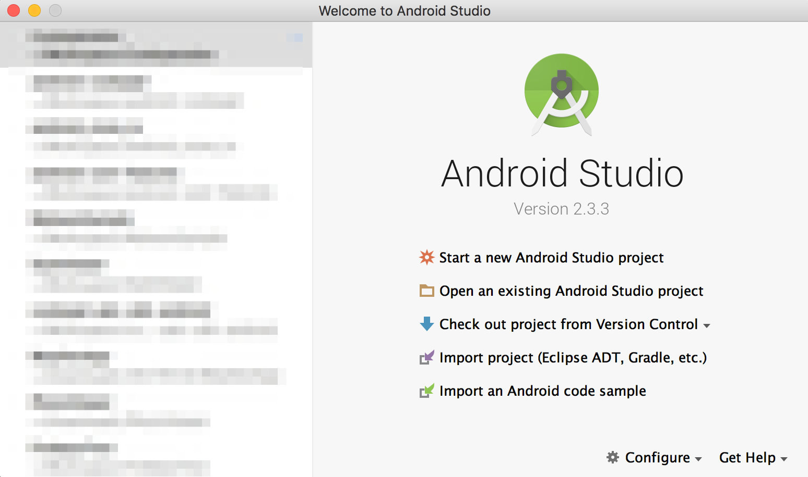

`Start a new Android Studio Project`を選択して、新しいプロジェクトを作成しましょう。

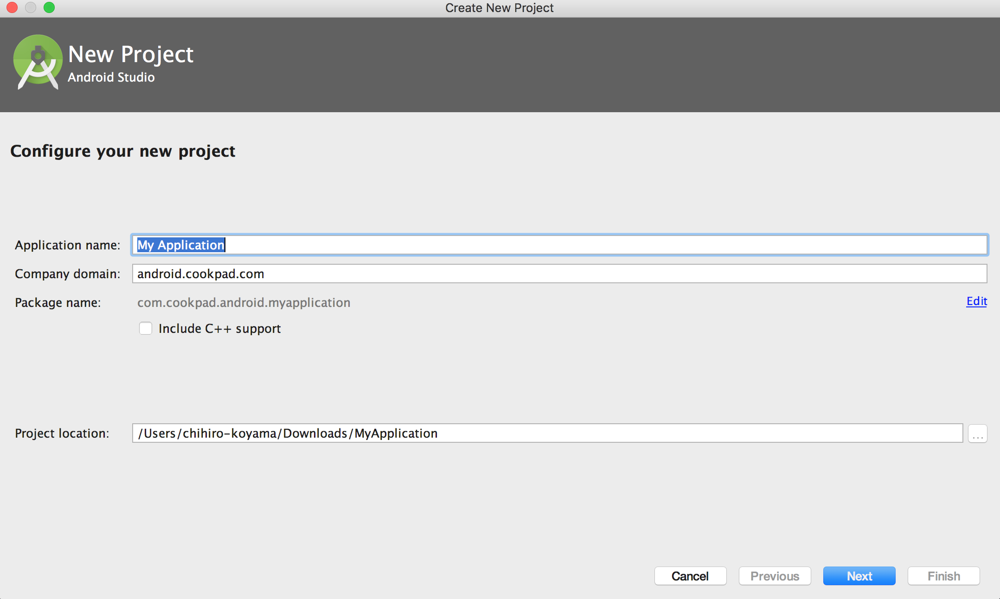

プロジェクトの情報を入力する画面になりました。
それぞれの入力欄には以下のような意味があります。

- Application name
    - いまから作るアプリケーションの名前です
- Company Domain
    - 開発者を特定できる情報を書きます
    - 一般的にはドメインを入力しますが、対象ドメインを取得している必要はありません
- Project location
    - プロジェクトファイルを配置する場所(ディレクトリ)です

`Company Domain`と`Application name`を元に`Package Name`というアプリケーションのIDが生成されます。
世の中にアプリをリリースするためにはこの`Package Name`が世界中で一意になるようにする必要があります。

今回はサンプルアプリなので、全員以下のように入力してみてください。

```
Application name: My Application
Company Domain: android.cookpad.com
Project location: そのまま
```

入力できたらNextで次のステップへ進みます。

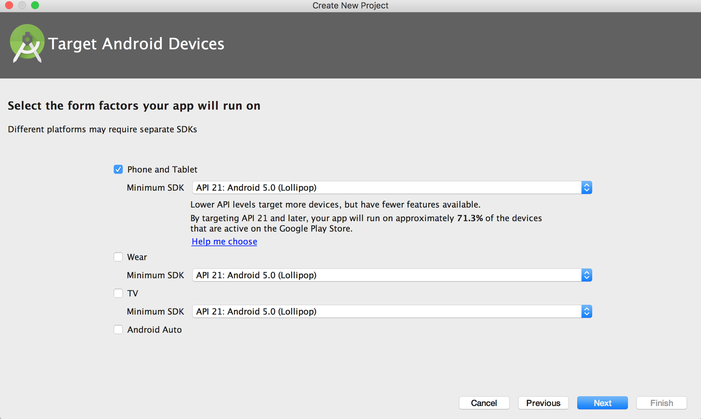

この画面ではアプリがサポートするプラットフォームやOSバージョンを設定します。
今回はスマートフォンアプリを作成するので、`Phone and Tablet`にチェックを入れます。
`Minimum SDK`の設定値はどこまで古いOS versionをサポートするかを示しています。
今回は `API 21: Android 5.0 (Lollipop)` を選択します。

選択できたらNextで次のステップへ進みます。

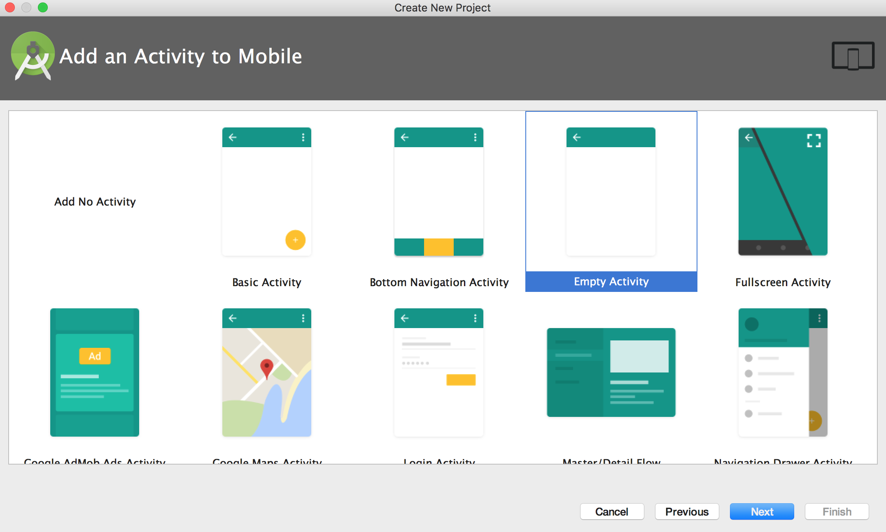

Android Studioではプロジェクトを作成する際、最初の画面のテンプレートも同時に作ることができます。
今回はもっとも基本的な`Empty Activity`を選択して`Next`で次のステップへ進みます。

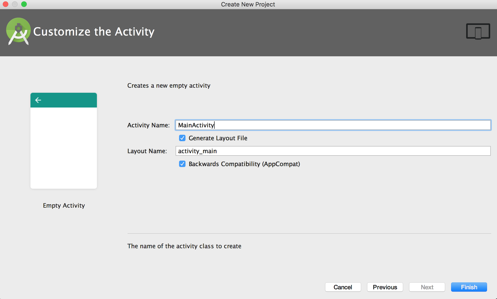

この画面では初期画面の名前や、そのレイアウトファイル名の変更ができます。
今回は何も変更せず`Finish`しましょう。

自動的にプロジェクトが生成され、そのままAndroid Studioでプロジェクトが開かれます。

## プロジェクトの構成

左側のプロジェクトウィンドウにプロジェクトの構成が表示されています。
以下で説明する構成要素すべてをまとめたものがAndroidプロジェクトになります。

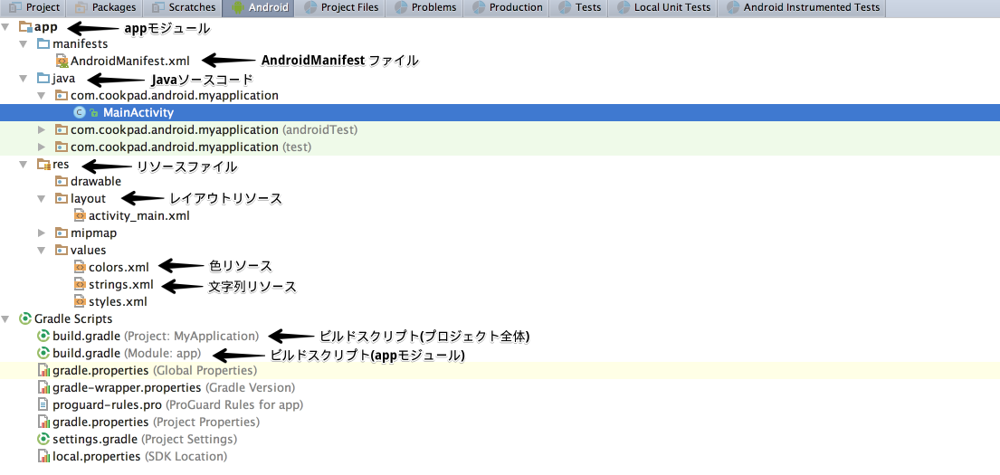

### appモジュール

プロジェクトの管理をしやすくるすため、機能ごとにプロジェクトの一部を分割したものをモジュールと呼びます。
Android Studioではアプリプロジェクトの作成時、自動的にappモジュールを作成し、そこにアプリの構成要素を配置します。


### AndroidManifest ファイル

Androidアプリの名前や起動方法などの情報をまとめて定義したXMLファイルを`AndroidManifest`と呼びます。
新しい画面(Activity)を定義した場合やアプリが必要とする権限を変更する場合はこのファイルに追記します。


### javaソースコード

javaソースコードはjavaディレクトリ以下にパッケージ単位でフォルダを作って管理します。

### res ディレクトリ

アプリで利用する画像や文字列などのリソースはresディレクトリ以下の決められた箇所で管理します。
文字列や数値をアプリケーションコードとは別の領域で保存することで多言語対応やタブレット対応しやすいようになっています。

代表的なリソースの種類は以下の様なものがあります：
- レイアウトリソース
    - アプリの画面デザインを定義できます
- 色リソース
    - アプリで利用する色情報を定義できます
- 文字列リソース
    - アプリで利用する文字列を定義できます

### ビルドスクリプト

AndroidアプリはGradleというビルドシステムを利用しています。
プロジェクトとモジュールそれぞれに`build.gradle`という設定ファイルがあり、appモジュールの`build.gradle`ファイルにはアプリで利用するライブラリやビルド時の細かい設定が記述されています。

## アプリの実行

Android Studioでプロジェクトを作成した時点で、アプリのビルドに最低限必要な設定はすでに行われています。
画像のボタンを押下して、実際にアプリをビルドしてみましょう。

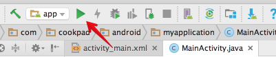

実行するとアプリをインストールする端末を選ぶ画面が表示されます。
いまは端末も繋いでおらず、エミュレータも未設定の状態なので、以下のように端末情報が空のダイアログが表示されます。

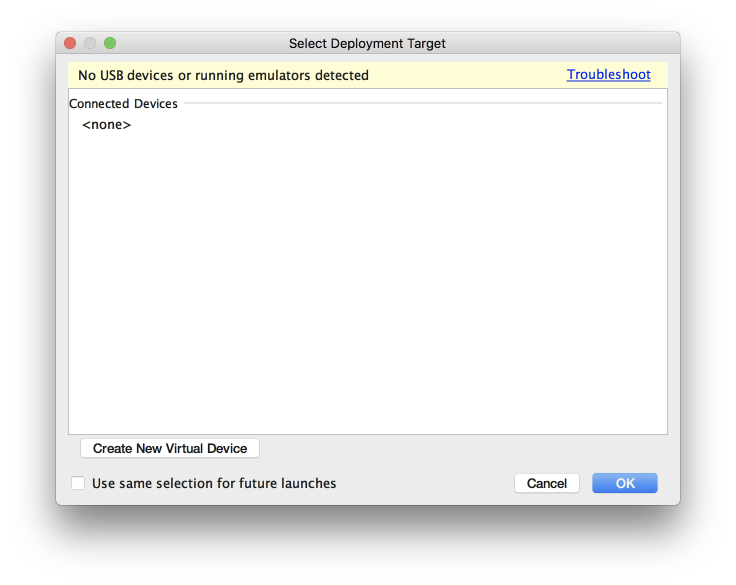


左下の `Create New Virtual Device` からアプリを実行するエミュレータを作成してみましょう。
Android のエミュレータは解像度などの **デバイス情報** とOSバージョンなどの **システムイメージ** の組み合わせで作ります。
今回は Android 7.1 の Nexus 5X という組み合わせにしてみましょう。

まず、端末一覧の中から`Phone -> Nexus 5X` を選択します。

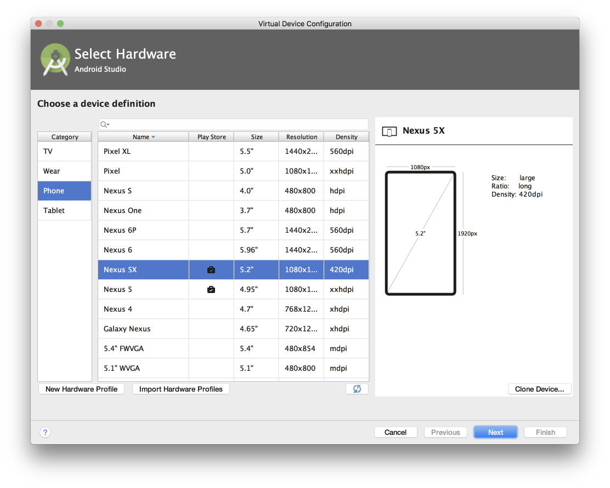

次に、システムイメージの一覧から **x86 向けの Android 7.1.1(Google APIs)** を選択します。
`Recommended` にない場合は `x86 Images` から探してください。
人によってはシステムイメージのダウンロードが必要かもしれません。それほど時間はかからないはずなので、必要な人はダウンロードしておいてください。
**要注意：x86 ではなく x86_64 を選んでしまうと日本語入力が正常に行えなくなります**

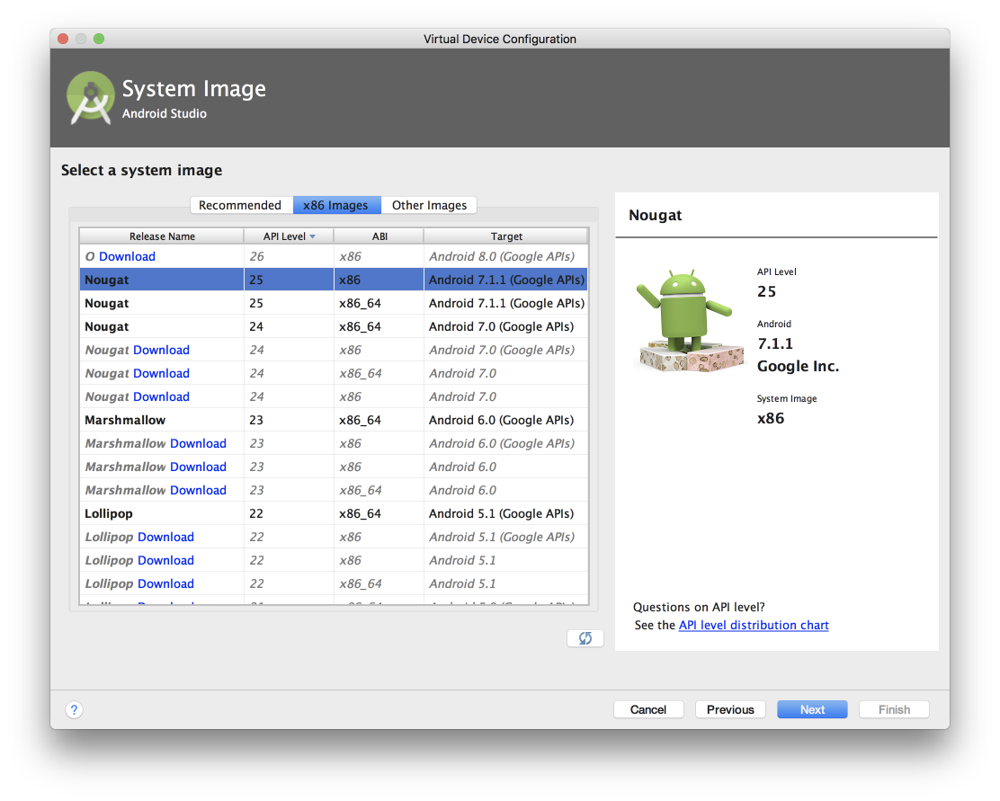

システムイメージの選択ができると作成したエミュレータに名前をつけて保存する画面になります。そのまま Finish しましょう。

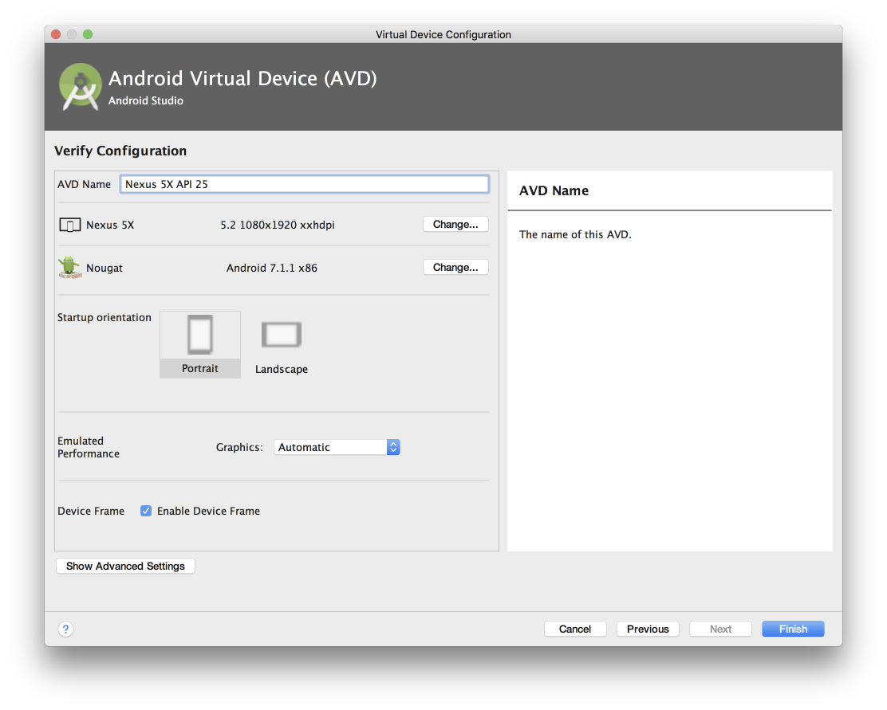

エミュレータは複数作ることができるので、間違えて別の組み合わせで作成してしまった人は先程と同じ手順で新しいエミュレータを作成してください。

エミュレータの作成が終わるとさきほどの実行端末を選ぶダイアログが表示されます。
先程作成したエミュレータを起動して実行してみましょう。

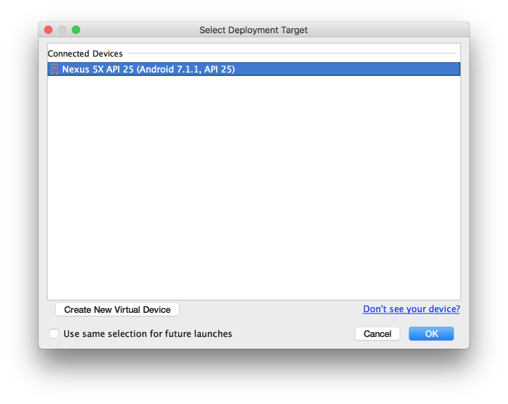

以下のような画面が表示されればHelloWorldアプリの実行が成功しています。


## エミュレータが起動しないときは

Docker for Mac、あるいはVirtual Boxなどが動いていると、エミュレータが正常に起動しない場合があります。
そのときは、Docker for Macを終了してからエミュレータを立ち上げてみましょう。

## エミュレータの日本語設定

現在のエミュレータは英語設定になっており、キーボードも英語入力しか行えません。
今回作成するのはメッセージのやりとりを行うアプリなので、いまのうちに日本語が入力できるように設定しておきましょう。

手順を説明するのが難しいので、以下の動画を参考に設定して下さい。

https://youtu.be/1zyd4FcP0to

全員の設定が終わったら少し休憩して次の課題へ進みます。

## 次回予告

次は [この講義で作成してもらうアプリについての説明](02-firebase.md) です。
説明だけなのでサクッと終わります。
