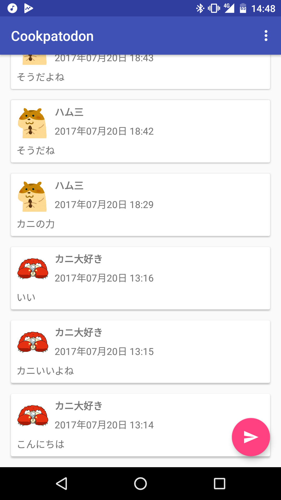
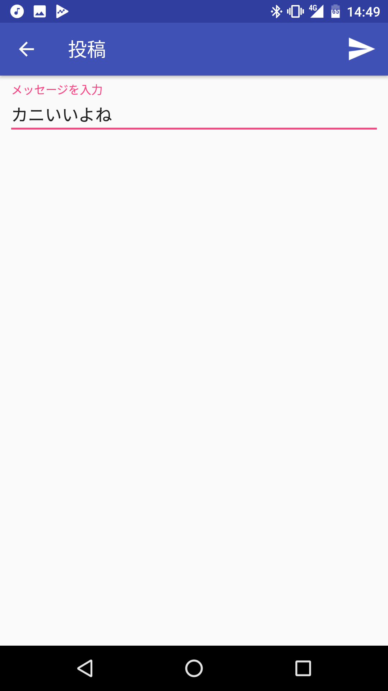
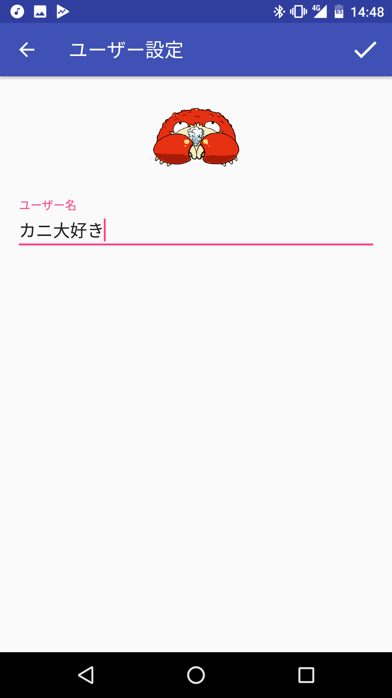

# この講義で作成してもらうアプリについて

### 内容

架空のSNSサービス「Cookpatodon（くっくぱっとどん）」の Android アプリ

- ユーザーがメッセージを投稿できる
- 他のユーザーや自分が投稿したメッセージが表示できる
- ユーザーアイコンと自分の表示名を変更できる

|投稿一覧画面|投稿画面|ユーザー設定画面|ユーザーアイコン選択画面|
|:---:|:---:|:---:|:---:|
|  |  |  |  |

※画像はプロによる作例です。講義内容と一部異なる部分があります。


### 技術仕様

各ユーザーは `Anonymous Auth` によってログインを行います。
投稿された内容は `Firebase Realtime Database` によって記録します。

### このアプリを作るために必要な知識

- Androidアプリの基本的な画面の構築方法
- Androidアプリの基本的な画面遷移の構築方法
- Firebase SDK の使い方


## Firebaseとは

FirebaseはGoogleが提供しているマルチプラットフォーム対応のバックエンドサービスです。
色々な機能があり、組み合わせて使うことでいろいろな機能を持つアプリを簡単に作ることができます。

自分でサーバーアプリケーションを用意せずにバックエンド処理を行えることから、Firebaseや類似のサービスを利用した構成をサーバーレスアーキテクチャと呼ぶこともあります。
(自分でサーバーを用意しないだけで、Firebase の後ろには当然 Google のサーバーがあります)

## 今回利用するFirebase機能

### Firebase Auth

`Firebase Auth` を利用するとアプリに様々なログイン機能を実装することができます。
メールアドレスとパスワードによるログインの他、GoogleログインやTwitterログインなども実装することができます。
今回はユーザー操作なしで自動的にログイン情報を付与できる `Anonymous Auth`というログイン方法を利用します。

### Firebase Realtime Database

`Realtime Database`はJSONのような形式でデータを保存するNoSQL系のデータベースです。
名前の通りリアルタイムで接続している各端末にデータを同期することができるのが大きな特徴になっています。
すべてのユーザーの端末に入っているデータを同期するという一番面倒な処理をSDKがやってくれるので、とても簡単に実装できます。

例えば、Realtime Database の`/data`階層以下にデータを書き込む場合、以下のような1行だけで表現可能です。

```java
FirebaseDatabase.getInstance().child("data")getReference().setValue(data);
```

このように Realtime Database は簡単に読み書きができる反面、通常のSQLのような異なる階層データの結合やサブクエリを表現することは難しくなっています。
そのため、一見冗長に見えても複数箇所に同じデータを保存してある階層以下を見るだけで一件のデータとして表現可能にしたり、`{ key : true }` 形式のリレーションによってデータの関連付けを行ったりします。

### 今回作成するデータベース構造

```txt
{
  "users" : {
    "uid1" : { // Anonymous Authによるログイン時のUID
      "name" : "kani-daisuki", // このユーザーの名前
      "avatar" : "kani, // このユーザーのアイコン名
      "posts" : {　 // このユーザーの投稿一覧
        "pid1" : true,
        "pid2" : true,
        "pid3" : true,
      }
    },
    "uid2" : { ... },
    "uid3" : { ... },
  },

  "posts" : {
    "pid1" : { // pushした際に付与されるユニークkey
      "author" : "uid1", // 投稿ユーザーのUID
      "authorName" : "kani-daisuki", // 投稿ユーザーの名前
      "authorAvatar" : "kani", // 投稿ユーザーのアイコン名
      "body" : "message body",  // 投稿内容
      "attachedURL" : "https://google.com",　// URL
    },
    "pid2" : { ... },
    "pid3" : { ... },
  }
}
```

このデータ構造では、`/posts` 以下の各投稿データが ユーザーIDとは別にユーザー名とアイコン名も持っています。
通常のRDBではユーザーIDだけを保持してテーブル結合などによりユーザー名とアイコン名を取得しますが、 Realtime Database では階層を超えて再問い合わせをするのは非効率なので投稿データにも重複して持ちます。
ユーザー名やアイコンを変更するときは `/users/UID/posts` 以下に過去の投稿IDのリストを持っているので、この投稿IDを元に直接対象の投稿のデータ(`/posts/PID/authorName`)にも変更を適用します。
Realtime Database では `/posts/PID/authorName` のような深い階層のデータも簡単に編集できるので、このように一見冗長に見えるデータ構造でも実用に即した形で扱えるようになっています。

## 次回予告

次はさきほど説明した [Anonymous Auth によるログイン処理の実装](03-implement_anonymous_auth.md/) を行います。
