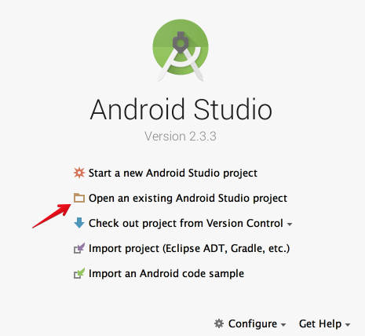
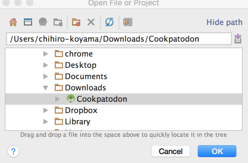
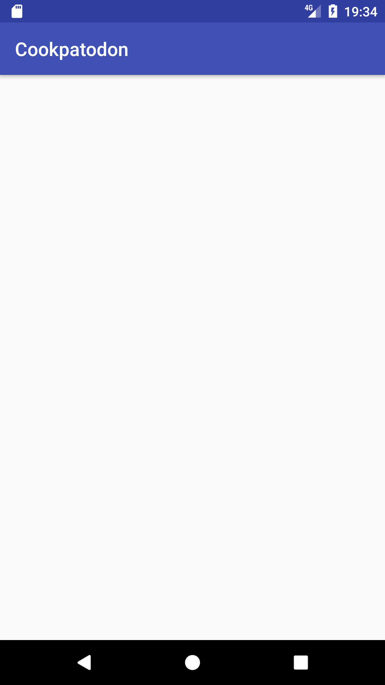
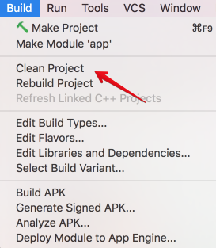

# ログイン機能の実装

## Firebaseのアプリへの導入

Firebaseのアプリへの導入方法はの[公式ページで詳しく説明されています](https://firebase.google.com/docs/android/setup)。
Androidアプリでは`build.gradle`ファイルでFirebaseライブラリの利用を宣言し、Firebaseプロジェクトで生成したjsonファイルを所定の場所に配置することで導入できます。

今回は全員で同一のプロジェクトを利用するため、すでにjsonファイルを導入済みのプロジェクトを配布します。
以下のファイルをダウンロードし、好きな場所に展開して下さい。

〜補足〜

実際のインターンではここでFirebase導入済みのAndroidプロジェクトを配布していました。
配布プロジェクトではFirebase導入、画像リソースの追加や[画像リソースを名前で扱うための実装](source/ImageUtils.java)も含まれていました。

〜補足終わり〜

次に、Android Studioで展開したプロジェクトファイルを開きます。
起動後直後の画面から`Open an existing Android Studio project`を選択します。



先程展開したプロジェクトを選択します。



うまく読み込めた人は [lesson01](01-hello_world.md) のときのようにエミュレータで実行してみてください。
以下のような画面が出れば成功です。



うまく行かなかった人はサポートするので、手を上げて教えてください。

(全員がアプリの実行に成功するまでサポート)

これでFirebase導入済みのプロジェクトを手元で利用できる状態になりました。

## Anonymous Auth の実装

では、配布したプロジェクトを元にAnonymous Authによるログインを実装してみましょう。

### Anonymous Auth によるログイン宣言
Anonymous Authによるログインの実行処理は非常に簡単です。
以下の1行を実行するだけで端末がまだログインしていない場合は匿名認証によるログイン処理を行い、すでにログインしたことがあれば以前のアカウント情報でログインを行います。

```java
FirebaseAuth.getInstance().signInAnonymously();
```

今回のアプリでは起動時にこの処理を実行する必要があるため、`MainActivity`の`onCreate()`メソッドに上記の1行を記述します。
ただログインするだけでは成功したかどうかわからないので、ついでにログイン成功した場合にメッセージを表示するようにしてみましょう。

以下のコードは修正後の `onCreate` メソッドです。
そのままコピペすると`FirebaseAuth`などのクラスへの参照が定義されていないため、エラー表示されていると思います。
エラーメッセージに従い、import文を追加してビルドエラーを解決してみましょう。

```java
@Override
protected void onCreate(Bundle savedInstanceState) {
    super.onCreate(savedInstanceState);
    setContentView(R.layout.activity_main);

    // Anonymous Authによる認証を実行
    FirebaseAuth.getInstance().signInAnonymously().addOnSuccessListener(this, new OnSuccessListener<AuthResult>() {
        @Override
        public void onSuccess(AuthResult authResult) {
            FirebaseUser user = authResult.getUser();
            if (user != null) {
                // 認証成功
                Toast.makeText(MainActivity.this, "認証成功", Toast.LENGTH_SHORT).show();
            }
        }
    });
}

```

上記の編集ができたらアプリを実行してみましょう。
うまくビルドできない、うまく実行できないという場合はAndroid Studioの`Build -> Clean Project`した後に`Build -> Rebuild Project`を試して下さい。



起動後、以下のような画面になればAnonymousAuthによるログインが成功しています。


## 注意事項
今回の講義では、特にgitの操作などについては説明しません。
各自、このファイルを展開したディレクトリで`git init`し、それぞれ必要だと思ったタイミングで commit してください。
最終的にできたところまでのリポジトリをGitHub Enterprise にpushしてもらいます。

## 次回予告

次は [投稿データを取得する処理の実装](04-get_post_list.md/) です。
