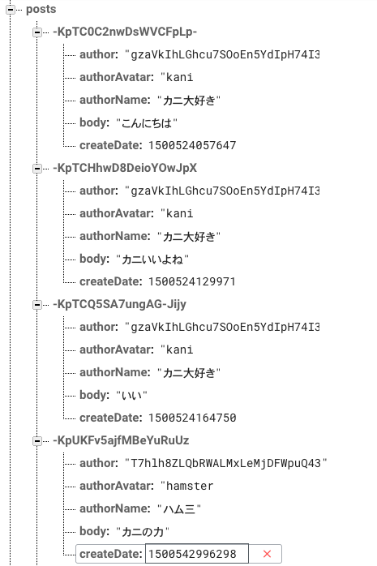
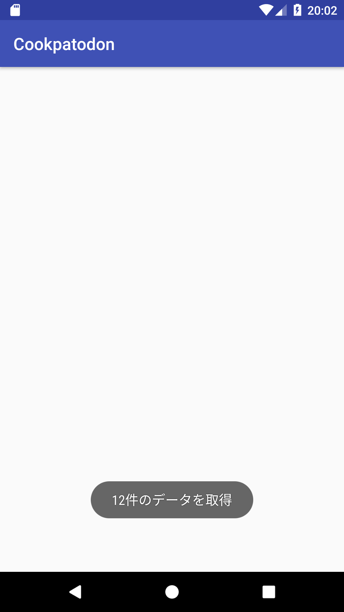

# 投稿データの取得

## 投稿データの構造

今回利用するFirebaseプロジェクトでは、投稿データは以下のような構造で管理されています。

```
}
  "posts" : {
    "pid1" : { // pushした際に付与されるユニークkey
      "uid" : "uid1", // 投稿ユーザーのUID
      "authorName" : "kani-daisuki", // 投稿ユーザーの名前
      "authorAvatar" : "kani", // 投稿ユーザーのアイコン名
      "body" : "message body",  // 投稿内容
      "attachedURL" : "https://google.com",　// URL
    },
    "pid2" : { ... },
    "pid3" : { ... },
  }
}
```

データベースにはすでに数件のデータが含まれているので、まずはこれらの情報を取得してみましょう。



## 投稿一覧の取得

`Realtime Database` では、すべてのデータを key-value の階層として管理しています。
アプリ側ではこの階層構造を利用し、「ある階層以下のデータを取得」といった要求を行うことでデータの取得を行います。

具体的なデータ取得には以下のような方法があります。

- addValueEventListener
    - ある要素以下の全てのデータの変更を監視する方法です
    - データが変更される度にあたらしいデータを取得できます
    - リスナーを解除するまでデータの更新を検知するので、不要になったらリスナーを解除する必要があります
- addListenerForSingleValueEvent
    - 一度だけ、ある要素以下の全てのデータを取得する方法です
    - 一度しかデータの取得を行わないため、リスナーの解除が不要です
- addChildEventListener
    - ある要素の **子要素** の変更を監視する方法です
    - 追加、更新、削除などのイベント種類を知ることができます
    - 不要になったらリスナーを解除する必要があります

今回は `addValueEventListener` を使って常に最新のリストを表示するように実装してみましょう。

`/posts/` 以下の全ての変更を `ValueEventListener` で監視することで、常に最新のリストを表示することができます。


まず、実装のための変数をクラスの上のほうに定義します。

```java

public class MainActivity extends AppCompatActivity {

  // データベースへの接続を設定
  private DatabaseReference reference = FirebaseDatabase.getInstance().getReference();

  // データベースの変更リスナー
  private ValueEventListener valueEventListener;

  ...
```

次に、`ValueEventListener`を使って`/posts`以下の要素変更を監視する処理を書きます。
`ValueEventListener` を利用した監視処理では監視の **開始** と **終了** をそれぞれ定義する必要があります。
`Activity`は表示状態によっていろいろなライフサイクルメソッドを持ちますが、今回は「画面が見えるようになったときに監視を開始」「画面がみえなくなったら監視を終了」という仕様で実装してみましょう。
画面がユーザーから見えるようになったときに呼ばれる処理は`onStart()`、はユーザーから見えなくなったときに呼ばれる処理は`onStop()`に記述します。

以下のコードは`onStart()` で`/posts`以下の変更監視を開始し、`onStop()`で監視を終了します。
変更を検知した場合はトーストで`n件のデータを取得`と表示します。

```java
    ...

    @Override
    protected void onStart() {
        super.onStart();
        // ログイン済みかどうかのチェック
        if (FirebaseAuth.getInstance().getCurrentUser() != null) {
            // データ取得後の処理を定義
            valueEventListener = new ValueEventListener() {
                @Override
                public void onDataChange(DataSnapshot dataSnapshot) {
                    // データ件数を表示
                    Toast.makeText(MainActivity.this, dataSnapshot.getChildrenCount() + "件のデータを取得", Toast.LENGTH_SHORT).show();
                }

                @Override
                public void onCancelled(DatabaseError databaseError) {

                }
            };

            // /posts 以下の変更をすべて取得
            reference.child("/posts").addValueEventListener(valueEventListener);
        }
    }

    @Override
    protected void onStop() {
        super.onStop();
        // リスナーの削除
        if (valueEventListener != null) {
            reference.child("/posts").removeEventListener(valueEventListener);
            valueEventListener = null;
        }
    }
```

以下のような画面が出れば成功です。




## 次回予告

次は[投稿内容の一覧を表示](05-show_post_list.md/)してみましょう。
いよいよ画面の変更も行います。
