# 投稿一覧の表示

## RecyclerView の用意

投稿データの取得ができたので、このまま投稿内容の表示も実装してみましょう。
リスト表示は`RecyclerView`という部品を使って実装します。

`RecyclerView`は子要素のアイテムを表現したViewを様々な配置で並べることができる部品です。
名前の通り、アイテムのViewを再利用(リサイクル)することで効率よくリスト要素を表現することができます。

`RecyclerView`は以下の5つの要素で構成されています。

- RecyclerView 本体
- アイテムViewのレイアウトを定義するXMLファイル
- アイテムのモデルクラス
    - 今回は投稿データのモデルクラス
- RecyclerView.Adapter
    - `Adapter`はモデルクラスのリストと`ViewHolder`の管理を行います
- ViewHolder
    - `ViewHolder`は個々のアイテムをアイテムViewにマッピングする役割を持ちます
- LayoutManager
    - アイテムViewをどのように並べるかを制御します

上から順番に準備していきましょう。

## ReyclerViewの追加

まずは `RecyclerView` を配置するために `activity_main.xml` を開いてみましょう。
以下のような画面が出ると思います。

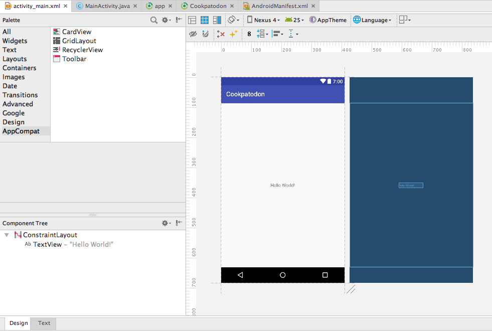

`RecyclerView` を追加するために、左上の Palette で `AppCompat -> RecyclerView`を探しましょう。
見つかったらレイアウトプレビューの配置したいところにドラッグ&ドロップします。

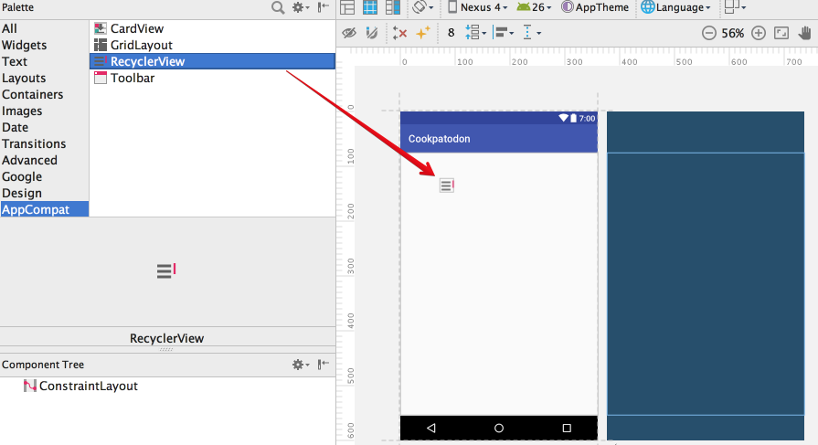

以下のようにレイアウトプレビューに`RecyclerView`が追加されたと思います。

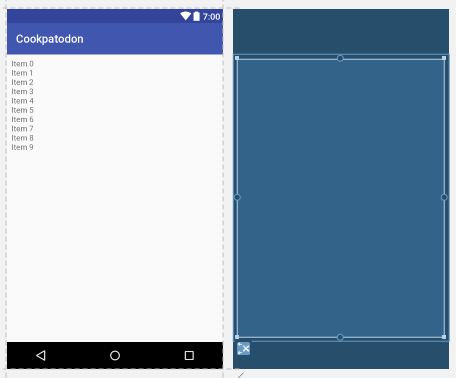

一見このままでも良さそうに見えますが、実はこの`RecyclerView`は縦横サイズが固定になっています。
Android には色々な端末があるので、大きい液晶をもつ端末やタブレット端末では`RecyclerView`がズレて表示されたり見切れたりする可能性があります。
`RecyclerView`のプロパティを調整して画面いっぱいに表示するように設定してみましょう。

`RecyclerView`をクリックして選択状態にした際、レイアウトプレビューの青いほうの画面で`RecyclerView`の四辺に小さい青丸がついているのがわかるでしょうか？

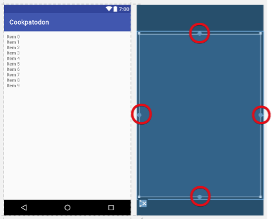

これは`RecyclerView`の上下左右が何を基準に配置されるかを設定するためのハンドルです。
今回は画面いっぱいに広げたいので、画面の四隅に向かってドラッグ&ドロップします。
画面の外まで引っ張って話すと自動的に画面端に張り付くので、あまり厳密に操作しなくても大丈夫です。
(上下の青帯はそれぞれアクションバーとナビゲーションバーなので、いま説明している画面外の領域になります)

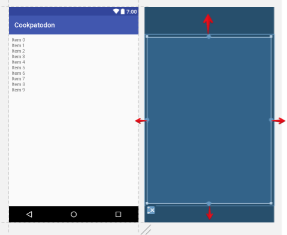

うまく設定できると右上の`Properties`ウィンドウの表示が以下のようになると思います。
これは`RecyclerView`の上下左右の位置がそれぞれ画面の上下左右を基準に配置されているという意味です。
8という数字はそれぞれ上下左右に 8dp の余白があるということを意味しています。

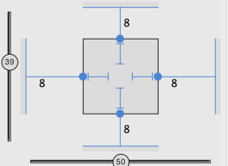


これで配置は調整できましたが縦横のサイズが固定のままなので、次に「`RecyclerView`を画面いっぱいに広げる」という指定を行います。
さきほどの`Properties`ウィンドウで`RecyclerView`の枠内に表示されている、左と上の線を一度ずつクリックしてみましょう。

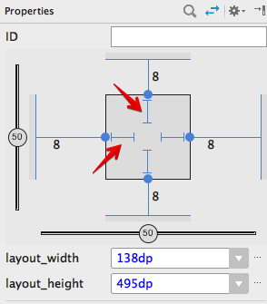

以下画像のようななんだかよくわからない波線になりました。

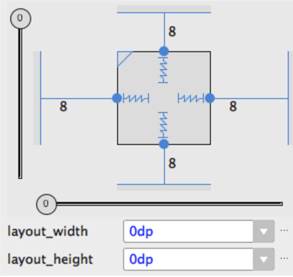

これは、`RecyclerView`に設定された配置情報と中のコンテンツに従って縦横の幅を決めるという指定です。
現在`RecyclerView`は画面の上下左右いっぱいから8dp余白をもって配置されているので、画面サイズに従って広がるようになりました。

これで`RecyclerView`の追加ができましたが、プログラム側から`RecyclerView`を扱うためには名前(View ID)をつける必要があります。
`Properties`のIDという欄に`recyclerView`という名前を入力しましょう。

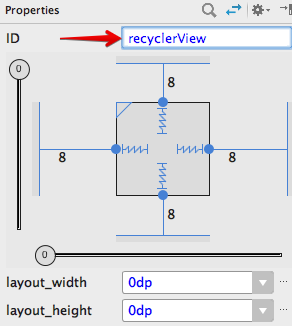

これで`RecyclerView`の準備はできました。
ここまでできたら`Command + s`で保存します。

次も同じようなレイアウトの編集になるので、ここまでうまくできていない人がいれば教えてください。
全員揃ったら投稿ひとつ分のデータを表示するアイテムViewのレイアウトを作っていきます。

## アイテムViewのレイアウトファイル追加

次に、`RecyclerView`の中に表示するアイテム表示用のレイアウトを用意します。
レイアウトディレクトリを右クリックし、`New -> Layout resource file`を選択します。

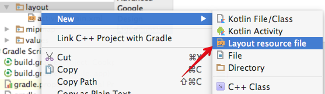

レイアウトリソースの設定ダイアログが出るので、以下のように入力して下さい。

```
File name: item_view
Root element: android.support.constraint.ConstraintLayout
```

`Root element` は入力補完が効くので `Const` を入力するとすぐ出てきて便利です。

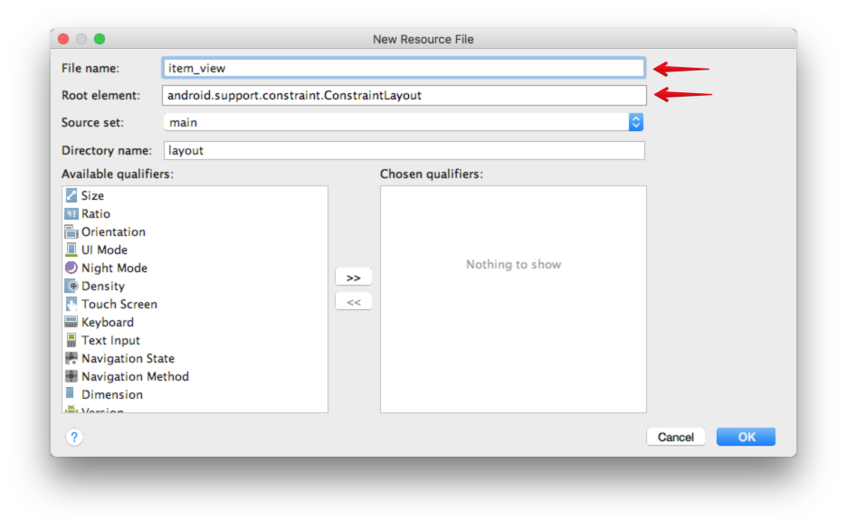

レイアウトが表示されたら、左上の`Palette`から`Images->ImageView`を選択して画面にドラッグします。

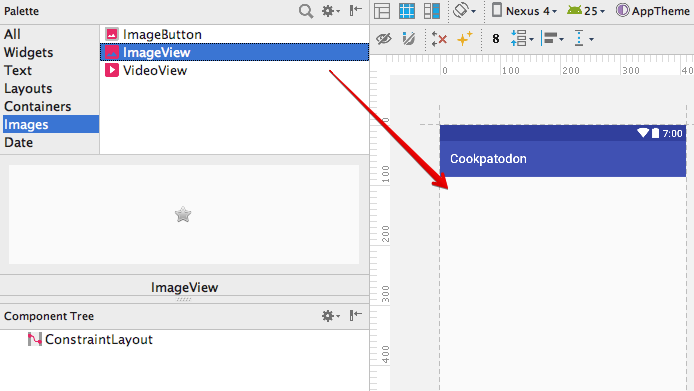

画像を選択するダイアログが表示されると思うので、検索欄に`unknown`と入力して？画像を選択します。

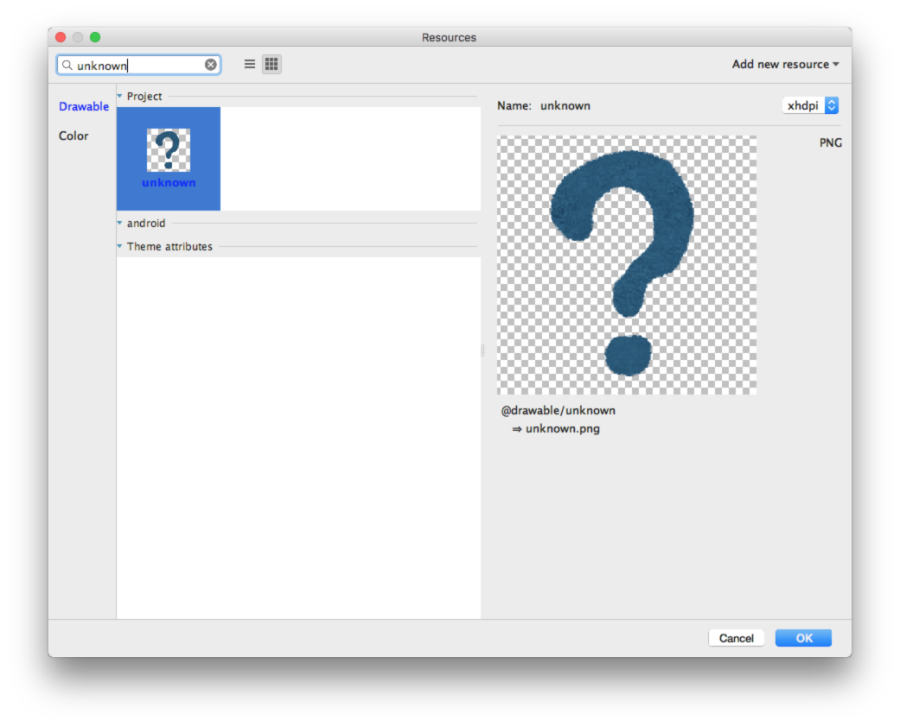

以下のような画面が表示されれば成功です。
`RecyclerView`のときと同様、左側と右側の青丸を画面端にドラッグ&ドロップしましょう。

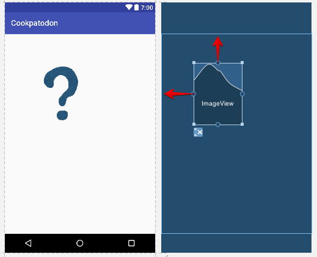

以下のようになれば成功です。

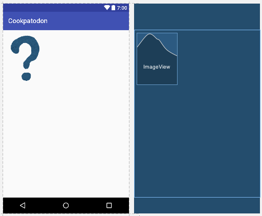

これで`ImageView`を左上に配置できました。
左下の`Component Tree`を見ると、`imageView` という名前が自動的に振られていることがわかります。
`RecyclerView`のときは設定してくれませんが`ImageView`や`TextView`ではこのように自動的にIDを振ってくれます。イマイチですね。

次に、投稿者の名前表示用の部品を追加してみましょう。
同じように`Widgets -> TextView`から画面内にドラッグ&ドロップします。

`TextView`を追加できたら青丸をドラッグ&ドロップし、以下のように接続します。

- 上の青丸：画面の上端
- 左の青丸：imageView の右端青丸に接続

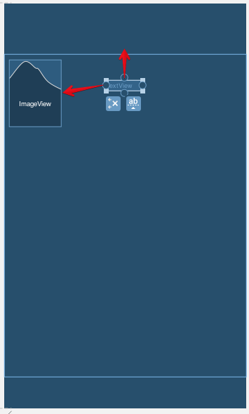

追加した`TextView`の左側の青丸を`ImageView`の右側の青丸にドラッグ&ドロップすると、ぐにゃぐにゃの線で繋がり、`TextView`が`ImageView`のすぐ右側に表示されると思います。
これは`TextView`を`ImageView`の右側に配置するという宣言です。

以下のようになれば成功です。

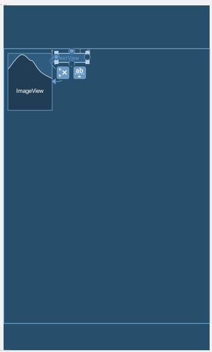

`TextView`はこの画面にいくつか追加する予定なので、投稿者名を表示する部品だとわかるように`author`というIDを設定しましょう。

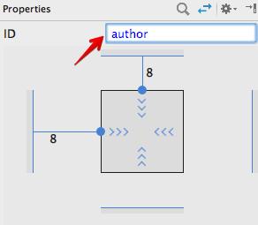


ここまでできたら、以下の部品追加を行ってみてください。

- `createDate` という `TextView` を追加
    - `createDate` は `imageView` の右側、`author`の下側に配置
- `body` という `TextView` を追加
    - `body` は 画面の左端、`imageView` の下側に配置
    - `body` の下は画面の下側にあわせる
- `Component Tree` で `ConstraintLayout` を選択し、`Properties`の`layout_height` を `wrap_conetnt` に更新します
    - これを忘れると画面中にひとつのアイテムしか表示されなくなります
    - 下記画像を参照して下さい

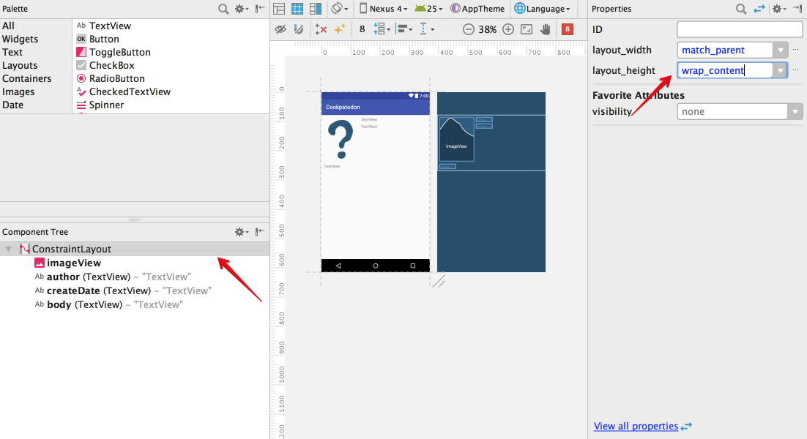

下記画像のような状態になっていれば成功です。
(Component Treeとレイアウトの表示に注目してください)

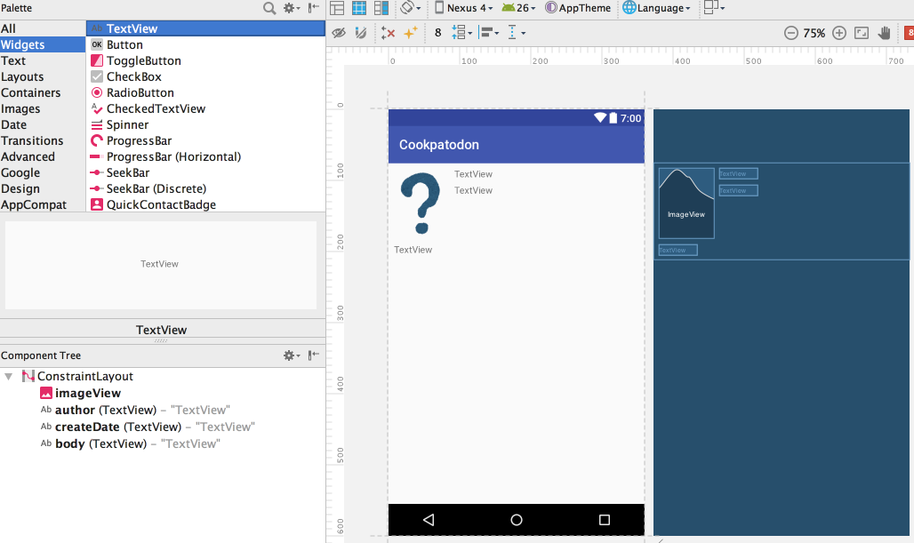

## モデルクラスの追加

次に、投稿データを表現するモデルクラスを追加します。
javaソースコードディレクトリの`com.cookpad.android.cookpatodon`ディレクトリを右クリックし、`New -> Java Class`を選択肢します。

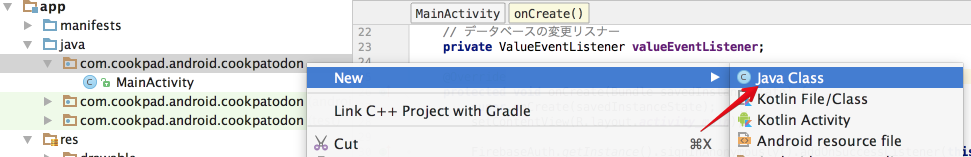

クラス名などを設定するダイアログが表示されるので、`Name : Post`と入力してOKを押します。

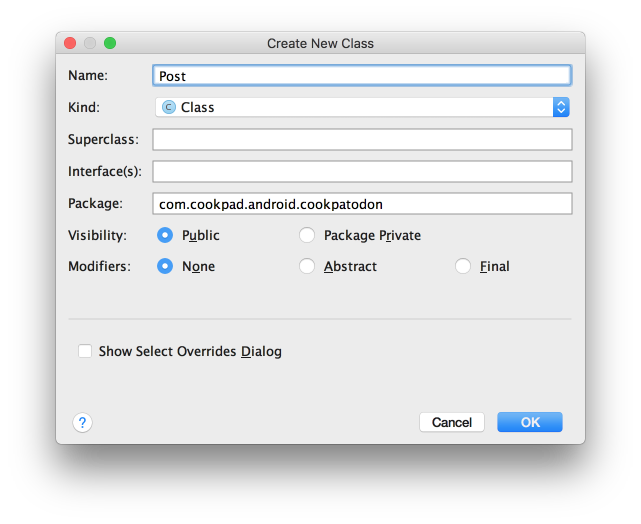

`Post`クラスが作成できたら、[lesson02](02-firebase.md)で紹介したDatabase定義に沿ってPostデータの定義を行います。
`toMap()` というメソッドは`Post`データを追加するときに使うものですが、ついでに今回定義してしまいましょう。

```java
public class Post {

    public String author;
    public String authorName;
    public String authorAvatar;
    public String body;
    public long createDate;

    public Map<String, Object> toMap() {
        Map<String, Object> result = new HashMap<>();
        result.put("author", author);
        result.put("authorName", authorName);
        result.put("authorAvatar", authorAvatar);
        result.put("body", body);
        result.put("createDate", ServerValue.TIMESTAMP);
        return result;
    }
}
```

これでモデルクラスの追加は完了です。

## RecyclerView.Adapter 、ViewHolderの追加

次に`Adapter`、`ViewHolder`の実装を進めます。
この2つは密接に関わっているので、同時に実装する必要があります。

```java
class Adapter extends RecyclerView.Adapter<Adapter.ViewHolder> {

    @Override
    public int getItemCount() {
        return 0;
    }

    @Override
    public ViewHolder onCreateViewHolder(ViewGroup parent, int viewType) {
        return null;
    }

    @Override
    public void onBindViewHolder(ViewHolder holder, int position) {

    }

    class ViewHolder extends RecyclerView.ViewHolder {

        public ViewHolder(View itemView) {
            super(itemView);
        }
    }

}
```

上記のソースコードが`Adapter`および`ViewHolder`の最小構成になります。
まずはこれを`MainActivity.java` の末尾(最後の`}` の前)にコピペして、必要な実装を追加していきましょう。

以下の作業ではこの追加した`Adapter`と`ViewHolder` の最小実装を改修していきます。
細かい変更箇所は説明しないので、メソッド名や処理の内容を良く見ながら、必要な箇所を改修していってください。

### Postリストの管理

現在の`Adapter`の実装はアイテム要素を何も管理していないので、`Post`リストを管理する機能を実装します。

```java
class Adapter extends RecyclerView.Adapter<Adapter.ViewHolder> {

        // 初期状態ではリストは空
        List<Post> itemList = new ArrayList<>();

        @Override
        public int getItemCount() {
            // itemList の件数を返す
            return itemList.size();
        }


        public void upateList(List<Post> itemList){
            // アイテムリストの更新
            this.itemList = itemList;

            // データの更新があったことを通知
            notifyDataSetChanged();
        }

        …(以下の実装は元のまま)
```

これで`Post`クラスのリスト定義と、アイテムの件数管理、アイテムリストの更新機能が実装できました。
アイテムリストに更新があった際は表示の更新を行う必要があるため、`upateList()`内の処理では`notifyDataSetChanged()`を呼んでいます。
`notifyDataSetChanged()`が呼ばれると`RecyclerView`はデータの更新が行われたと判定して全てのアイテムを表示し直します。

### ViewHolder の生成、データのバインド

`RecyclerView`ではアイテムのViewは画面表示に必要な数だけ生成され、スクロールなどで表示するアイテムがかわったときに古いアイテムViewを再利用するかたちで表示が更新されます。
このアイテムViewを管理するものが`ViewHolder`です
Adapterは必要な数の`ViewHolder`を生成し、各`ViewHolder`にアイテムの情報を与えます。

まず、`ViewHolder`の生成部分を実装してみましょう。
すでに定義済みの`ViewHolder`に `item_view` の管理機能を与え、 `Adapter` の `onCreateViewHolder()`メソッドで`ViewHolder`を生成するようにします。

```java
class Adapter extends RecyclerView.Adapter<Adapter.ViewHolder> {

  ...

  @Override
  public ViewHolder onCreateViewHolder(ViewGroup parent, int viewType) {
      // item_view.xml のレイアウトを生成
      View view = getLayoutInflater().inflate(R.layout.item_view, parent, false);

      // 生成したレイアウトをViewHolderに渡す
      return new ViewHolder(view);
  }

  ...

  class ViewHolder extends RecyclerView.ViewHolder {

      // アイコン表示用のImageView
      ImageView imageView;
      // ユーザー名表示用のTextView
      TextView author;
      // 日時表示用のTextView
      TextView createdDate;
      // 本文表示用のTextView
      TextView body;

      public ViewHolder(View itemView) {
          super(itemView);

          // アイテムViewにアクセスしやすいように変数にセット
          imageView = (ImageView) itemView.findViewById(R.id.imageView);
          author = (TextView) itemView.findViewById(R.id.author);
          createdDate = (TextView) itemView.findViewById(R.id.createDate);
          body = (TextView) itemView.findViewById(R.id.body);

      }
  }

}
```

次に、`onBindViewHolder()` メソッドで`ViewHolder`の持つViewにアイテム情報を表示させる処理を書きます。
画像名から画像を表示する処理は難しいので、すでにプロジェクトに定義していた`ImageUtils`を使っています。

```java
@Override
public void onBindViewHolder(ViewHolder holder, int position) {
    // 対象のPost情報を取得
    Post post = itemList.get(position);

    // 画像を表示する処理
    holder.imageView.setImageResource(ImageUtils.getDrawableResource(holder.imageView.getContext(), post.authorAvatar));

    // ユーザー名を表示する処理
    holder.author.setText(post.authorName);


    // エポックミリ秒を 2017年07月22日 16:50 のような文字列に変換する処理
    // java.text.SimpleDateFormat , java.util.Dateを使用しましょう
    String createDateString = new SimpleDateFormat("yyyy年MM月dd日 kk:mm", Locale.JAPAN).format(new Date(post.createDate));
    // 投稿日時を表示する処理
    holder.createdDate.setText(createDateString);

    // ユーザー名を表示する処理
    holder.body.setText(post.body);
}
```

これでやっとPostの中身をリスト表示する用意ができました。

## リストの更新

では、`Activity`から定義した`RecyclerView`にデータを表示するようにしてみましょう。
まず、`MainActivity`先頭、`DatabaseReference`などの定義をしている箇所に`Adapter`の定義を加えます。

```java
// データ表示用のAdapter
private Adapter adapter = new Adapter();
```

`Adapter`の定義ができたので、`onCreate()`で`RecyclerView`に`Adapter`をセットしてみます。
今回は縦にリスト上に並ぶようにしたいので、`LinearLayoutManager`を使います。
また、新しい投稿ほど上のほうに表示されて欲しいので、アイテムを逆順に表示するオプション(`ReverseLayout`)を利用します。

```java
@Override
protected void onCreate(Bundle savedInstanceState) {

    ...
    // 以前の定義内容の末尾に加えます

    // RecyclerView の取得
    RecyclerView recyclerView = (RecyclerView) findViewById(R.id.recyclerView);

    // RecyclerView に Adapter をセット
    recyclerView.setAdapter(adapter);

    // アイテムの並べ方を設定
    // 縦にならべたいので VERTICAL な LinearLayoutManager を定義しています
    LinearLayoutManager linearLayoutManager = new LinearLayoutManager(this);
    // アイテムを逆順に並べるように設定
    linearLayoutManager.setReverseLayout(true);
    linearLayoutManager.setStackFromEnd(true);
    recyclerView.setLayoutManager(linearLayoutManager);
}
```

次に、`onStart()`の中で定義していた `ValueEventListener` の `onDataChange()` メソッドでPostリストが取得できるので、これを使ってアダプターの内容を更新します。
このメソッドの引数になっている`DataSnapshot`には`posts`以下のすべてのデータが含まれていますが、`Post`のリストにするためには一件ずつ変換してリストに追加していく必要があります。

```java
@Override
public void onDataChange(DataSnapshot dataSnapshot) {
    // データ件数を表示
    Toast.makeText(MainActivity.this, dataSnapshot.getChildrenCount() + "件のデータを取得", Toast.LENGTH_SHORT).show();

    // 空リストを生成
    List<Post> itemList = new ArrayList<>();

    // posts 以下からデータを取り出してリストに追加する
    for (DataSnapshot postSnapshot : dataSnapshot.getChildren()) {
        Post post = postSnapshot.getValue(Post.class);
        itemList.add(post);
    }

    // リスト情報で Adapter を更新
    adapter.upateList(itemList);
}
```

これでやっとリストの表示ができるようになりました。
ビルドを実行してみましょう。


このような表示ができていれば成功です。

うまくできない人はスタッフや周りの人に聞いてください。
すでに動いた人は画像の大きさなどは`item_view.xml`の定義を調整すると変更することができるので、試してみると良さそうです。

(多分ここは時間がかかるので)ここで一旦10分休憩とします。

## 次回予告

次は実際に[自分でもメッセージを投稿](06-implement_post_message.md/)できるようにしてみましょう。
