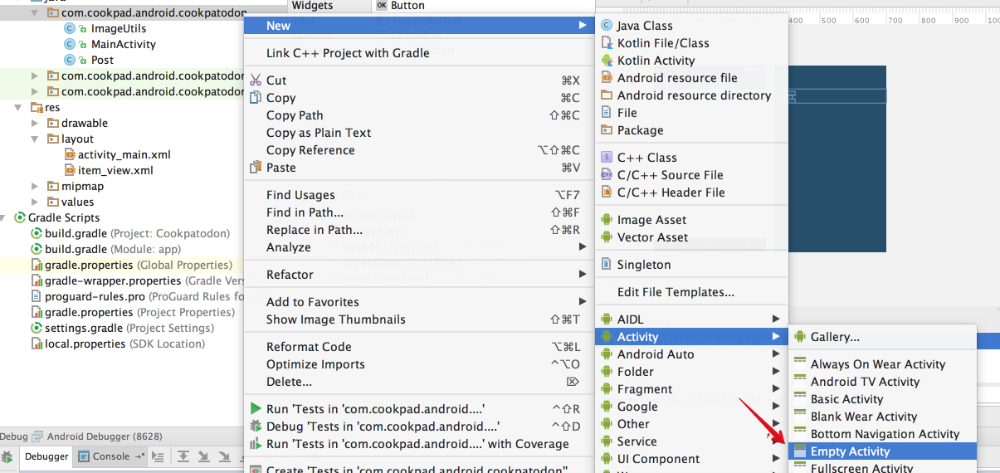
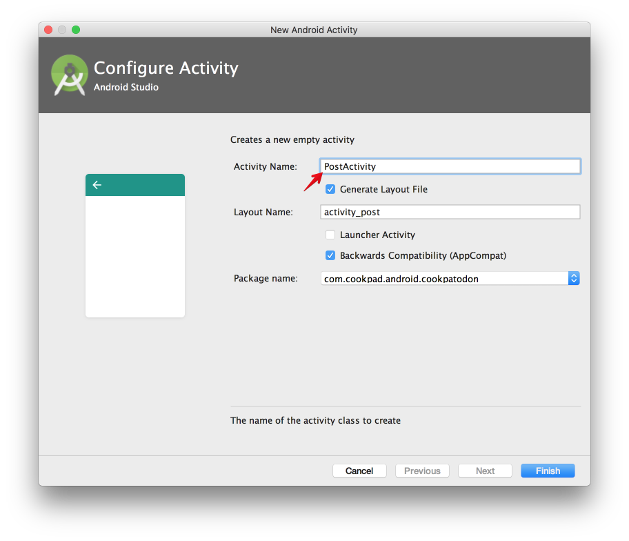
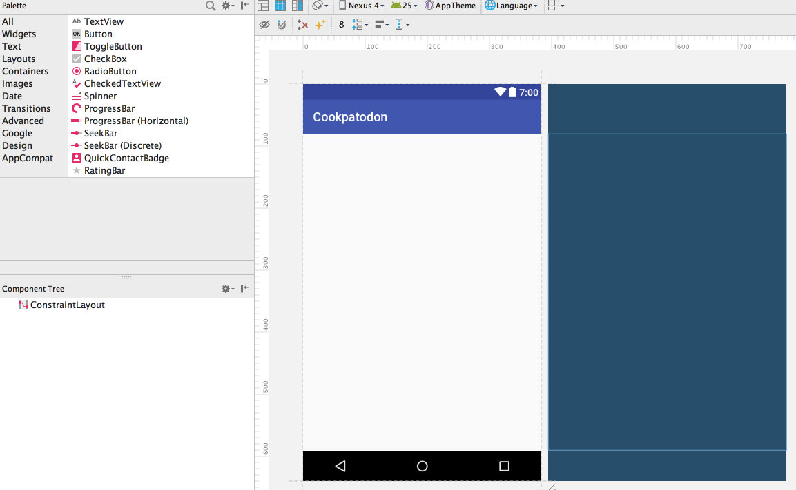
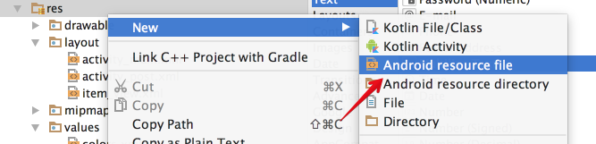
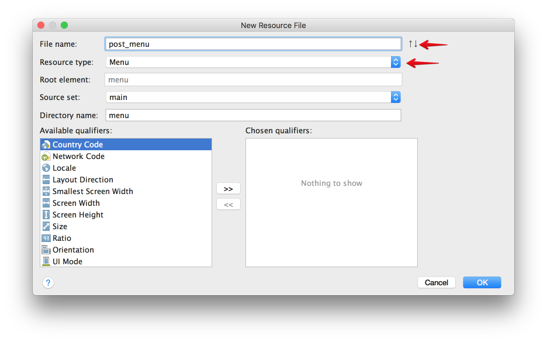
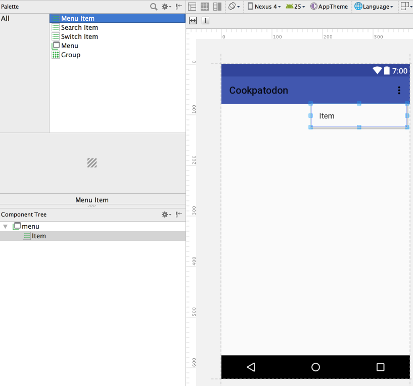
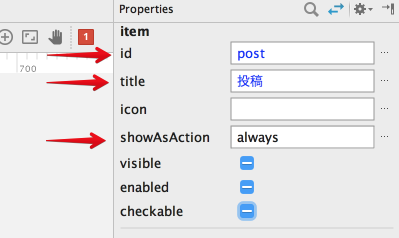
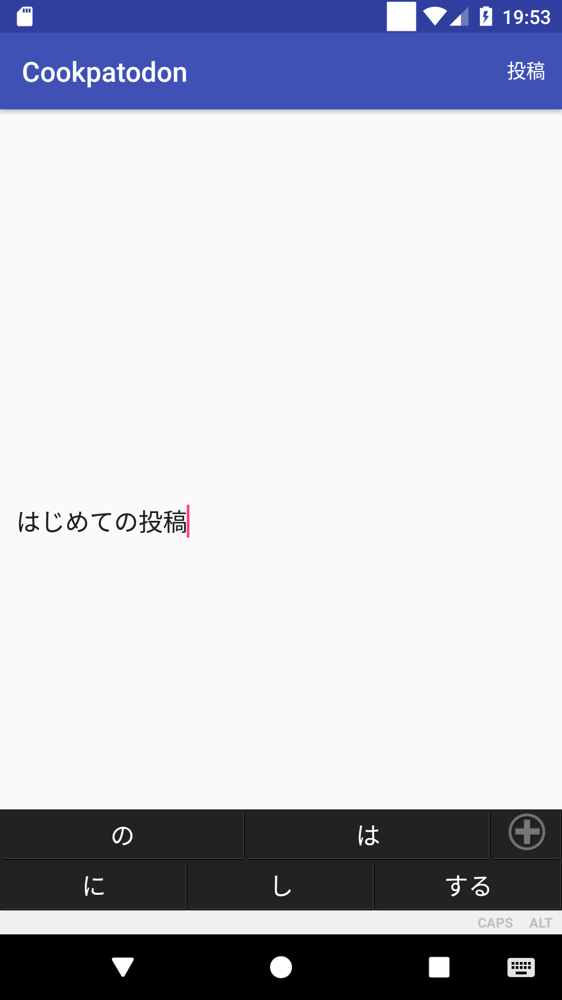
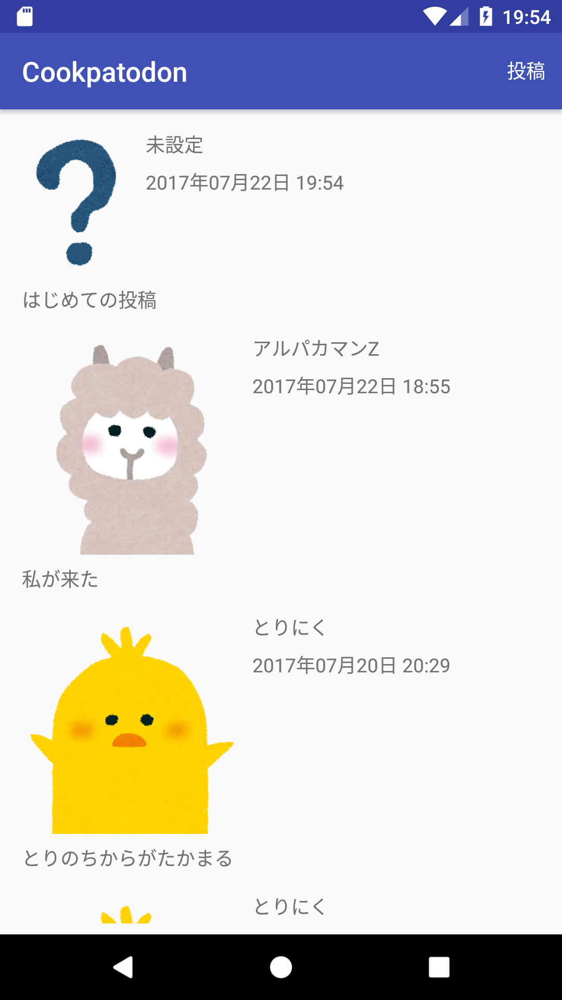

# 投稿画面の実装

## 初期ユーザー情報の設定

Cookpatodon ではメッセージを投稿するためにはユーザ名とユーザーアイコンが必要になります。
今回はとりあえず簡単に投稿できることを第一に、「アプリ起動時にユーザー名とユーザーアイコンが設定されていなかったら仮のものを設定する」という処理を実装してみましょう。

`Post`同様、`User`クラスがあったほうが都合が良いので、まずは`User`クラスを作ります。

```java
public class User {

    public String name;
    public String avatarName;
    public Map<String, Object> posts;

    public Map<String, Object> toMap() {
        Map<String, Object> result = new HashMap<>();
        result.put("name", name);
        result.put("avatarName", avatarName);
        result.put("posts", posts);
        return result;
    }
}
```

では、`User`クラスを使い、`MainActivity`の`onCreate()`メソッドの中で認証処理に成功した直後、「認証成功」というメッセージを出した直後に仮のユーザー情報を設定する処理を記述してみましょう。
`onCreate()`メソッドに元々記述されている部分を変更するので、変更範囲に気をつけて修正してみましょう。


```java
@Override
protected void onCreate(Bundle savedInstanceState) {
    ...

    FirebaseAuth.getInstance().signInAnonymously().addOnSuccessListener(this, new OnSuccessListener<AuthResult>() {
        @Override
        public void onSuccess(AuthResult authResult) {
            FirebaseUser user = authResult.getUser();
            if (user != null) {
                // 認証成功
                Toast.makeText(MainActivity.this, "認証成功", Toast.LENGTH_SHORT).show();

                final String uid = user.getUid();
                // ユーザー情報は /users/$uid 以下に格納されている
                reference.child("users").child(uid).addListenerForSingleValueEvent(new ValueEventListener() {
                    @Override
                    public void onDataChange(DataSnapshot dataSnapshot) {
                        if (!dataSnapshot.hasChildren()) {
                            // ユーザ名、アイコンなどが未設定なので仮設定
                            User user = new User();
                            user.name = "未設定";
                            user.avatarName = "unknown";
                            reference.child("users").child(uid).setValue(user.toMap());
                        }
                    }

                    @Override
                    public void onCancelled(DatabaseError databaseError) {

                    }
                });

            }
        }
    });
    ...
```

これで次回のアプリ起動時にユーザー情報が仮設定されるようになりました。
とりあえずここまでできたらアプリを実行してみましょう。
ビルドに失敗したりエラーが発生した人はスタッフやまわりの人に聞いて下さい。
全員ここまでできたら次のステップに進みます。

次はいよいよメッセージ投稿画面の実装です。
すでにアプリ起動時にユーザーの情報が仮設定されているので、メッセージの投稿ではこの仮設定されたユーザー情報を利用するようにします。

## 投稿画面の追加

投稿内容の表示ができるようになったので、次は実際に投稿する画面を実装してみましょう。



まずは投稿画面(`Activity`)の追加を行います。
Javaソースのパッケージを右クリックし、`New -> Activity -> Empty Activity`を選択します。



Activity情報を入力する画面が表示されるので、`Activity Name` に `PostActivity` と入力します。
`Activity Name`の内容に応じて`Lauout Name`の内容も自動的に更新されるので、このまま`Finish`します。

`Activity`を追加する際、`AndroidManifest.xml`への追記も必要ですが、`Android Studio`のメニューから追加した場合は自動的に追記してくれます。
余裕があれば`AndroidManifest.xml`に以下の記述があることを確認して下さい。

```
<activity android:name=".PostActivity"></activity>
```

次に、画面投稿用の画面レイアウトを作ります。
さきほどActivityを追加したときに`activity_post.xml`も自動的に追加されているので、探して開いてみましょう。



空っぽなレイアウトが表示されていると思います。
[lesson05](05-show_post_list.md)の内容を思い出しながら、以下の部品要素を追加してみてください。

- `body` という名前の複数行入力可能な入力欄
    -  複数行入力可能な部品は `Text -> Multiline Text`
    - 画面の上下左右にViewの上下左右を接続し、横幅を画面いっぱいに拡大


このようになっていれば成功です。

では、次に画面上部のバーに表示するメニューを作ってみましょう。



リソースディレクトリを右クリックし、`New -> Android resource file`を選択します。



リソース内容の入力画面が表示されるので、`File name`に`post_menu`、`Resource type`に`Menu`を入力します。
入力できたらOKを押しましょう。


レイアウトの編集画面によく似ていますが、これがメニューリソースの編集画面になります。
`post_menu`は投稿画面用のメニューなので、「投稿」メニューを作ってみましょう。
左上の`Palette`から`Menu Item`を画面にドラッグ&ドロップします。



ツールバーの拡張ボタンから展開できるメニューが追加されました。
追加したメニューに対して、`Properties`から属性の設定をしていきます。



- id を `post`
    - id は画面から各メニューを識別するためのものです
- title を 投稿
    - アイコンがないときに表示される文字列です
- `showAsAction` を `always`
    - ツールバーの中でのメニューの表示方法を決めます
    - `always` は常に省略せず表示するという意味です


メニューリソースエディタにこのように表示されていれば成功です。

## 投稿処理の実装

次に、投稿画面の処理を実装します。
`PostActivity.java`を開き、ユーザー情報の取得処理を書いてみましょう。

```
public class PostActivity extends AppCompatActivity {

    // 投稿時に使うユーザー情報
    private User user;

    // データベースへの接続を設定
    private DatabaseReference reference = FirebaseDatabase.getInstance().getReference();

    @Override
    protected void onCreate(Bundle savedInstanceState) {
        super.onCreate(savedInstanceState);
        setContentView(R.layout.activity_post);

        // ログインユーザーのUID
        String uid = FirebaseAuth.getInstance().getCurrentUser().getUid();

        // ユーザー情報を /users/$uid から取得
        reference.child("users").child(uid).addListenerForSingleValueEvent(new ValueEventListener() {
            @Override
            public void onDataChange(DataSnapshot dataSnapshot) {
                // ユーザー情報を取得
                user = dataSnapshot.getValue(User.class);
            }

            @Override
            public void onCancelled(DatabaseError databaseError) {

            }
        });
    }
}

```

これでこの画面の表示時、すでに仮登録済みのユーザー情報を参照できるようになりました。
(`PostActivity`は必ず`MainActivity`から遷移する、という前提のため、チェックを簡略化しています)

次に、`post_menu.xml`で定義した画面右上の「投稿」ボタンを追加しましょう。
メニューの追加は `onCreateOptionsMenu()` というメソッドででメニューリソースを指定して `inflate()` すれば追加されます。
以下の内容を `PostActivity.java` に追記してみましょう。

```java
@Override
public boolean onCreateOptionsMenu(Menu menu) {
    // post_menu で定義したメニューを画面に追加
    getMenuInflater().inflate(R.menu.post_menu, menu);
    return super.onCreateOptionsMenu(menu);
}
```

ではいよいよ、実際の「投稿」メニューによって投稿する処理を書いてみましょう。
メニュー押下時の処理は`onOptionsItemSelected()`メソッドで受け取ることができます。
[lesson02](02-firebase.md)で説明したとおり、`/posts` だけでなく `/users/$uid/posts` 以下にも投稿情報を追記する必要があるので要注意です。

```java
@Override
public boolean onOptionsItemSelected(MenuItem item) {

    // 選択されたメニューアイテムの id が post であれば投稿メニュー
    if (item.getItemId() == R.id.post) {

        // もし body が未入力であれば何もしない
        EditText bodyEditText = (EditText) findViewById(R.id.body);
        if (TextUtils.isEmpty(bodyEditText.getText())) {
            // body が未入力なので何もせず終了
            return false;
        }
        String body = bodyEditText.getText().toString();

        String uid = FirebaseAuth.getInstance().getCurrentUser().getUid();
        // user から投稿者情報を取得
        String authorName = user.name;
        String authorAvatar = user.avatarName;

        // 投稿情報の設定
        // createDate はサーバ側で入力するようになっているので設定不要です
        Post post = new Post();
        post.author = uid;
        post.authorAvatar = authorAvatar;
        post.authorName = authorName;
        post.body = body;

        // いまから投稿する内容のユニークkey
        String pid = reference.child("posts").push().getKey();

        // 投稿内容を /posts/$pid に追記
        reference.child("posts").child(pid).setValue(post.toMap());

        // /users/$uid/posts/posts にリンクを追加
        reference.child("users").child(uid).child("posts").child(pid).setValue(true);

        // 投稿できたら画面を終了
        finish();
        return true;
    }


    return super.onOptionsItemSelected(item);
}
```

## 投稿画面への遷移

ここまでの修正で、ユーザー情報の仮登録と入力内容の投稿ができるようになりました。
しかし、`MainActivity`から`PostActivity`への遷移が実装されていないため、まだ投稿画面に遷移することができません。
以下の修正を行い、`MainActivity`から`PostActivity`への遷移処理を実装してみましょう。

- `MainActivity` 用の `main_menu.xml` の追加
    - `main_menu.xml` は `id:post`、`title:投稿`、`showAsAction:always`のメニューを持つ
- `MainActivity` に `onCreateOptionsMenu()` メソッドを追加し、`main_menu`を表示するようにする
- `MainActivity` に `onOptionsItemSelected()` メソッドを追加し、`R.id.post` メニュー押下時に `PostActivity` に遷移するようにする

画面の遷移には遷移先の情報を記述した`Intent`というものを利用します。
`PostActivity`への遷移を明記した`Intent`を指定して`startActivity()`することにより、`PostActivity`に遷移することができます。

```java
@Override
public boolean onOptionsItemSelected(MenuItem item) {

    // 選択されたメニューアイテムの id が post であれば PostActivity に遷移
    if (item.getItemId() == R.id.post) {

        // PostActivity を起動
        Intent intent = new Intent(this, PostActivity.class);
        startActivity(intent);

        return true;
    }

    return super.onOptionsItemSelected(item);
}
```

## 実際に投稿する

ここまでできたらアプリをビルドしてエミュレータで実行してみましょう。
うまく実装できていれば投稿一覧の右上「投稿」ボタンから投稿画面へ遷移し、投稿内容を右上「投稿」ボタンから投稿できるようになっているはずです。

|MainActivity|PostActivity|MainActivty(再)|
|:---:|:---:|:---:|
||||

`MainActivity`に戻った際、リストは更新されていますが自動的に最新の投稿には移動しないので、上のほうにスクロールして投稿内容を確認してみてください。

うまくいかない場合はスタッフや近くの人に聞いてみましょう。
- 投稿一覧画面に投稿メニューがない
    - MainActivity 側の `onCreateOptionsMenu()` メソッドの処理を確認しましょう
- 投稿画面の投稿ボタンが反応しない
    - `main_menu` でメニューに設定されている id が正しいか確認しましょう
    - MainActivity の `onCreateOptionsMenu()` で `main_menu` を `inflate` しているか確認しましょう
    - MainActivity の `onOptionsItemSelected()` の実装内容を確認しましょう
- 投稿画面の投稿ボタンが反応しない
    - `post_menu` でメニューに設定されている id が正しいか確認しましょう
    - MainActivity の `onCreateOptionsMenu()` で `post_menu` を `inflate` しているか確認しましょう
    - MainActivity の `onOptionsItemSelected()` の実装内容を確認しましょう
- 投稿画面の投稿ボタンを押すとクラッシュする
    - ユーザー仮登録処理に問題があるかもしれません。スタッフを呼んで下さい。

今回登録した仮登録したユーザー名とアイコンは全員同じものなので誰の投稿かわからないかもしれません。
自分のものだと区別できるようなユニークなメッセージを投稿してみて下さい。


## 次回予告

ついにメッセージも投稿できるようになりました。
次はアイコンやユーザー名を変更できる [ユーザー情報設定画面の実装](07-implement_user_setting.md) です。
