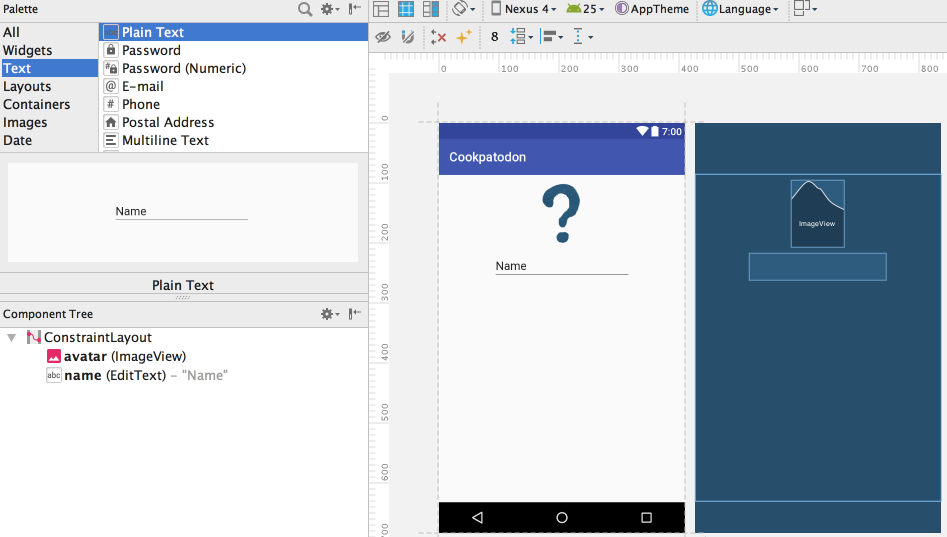
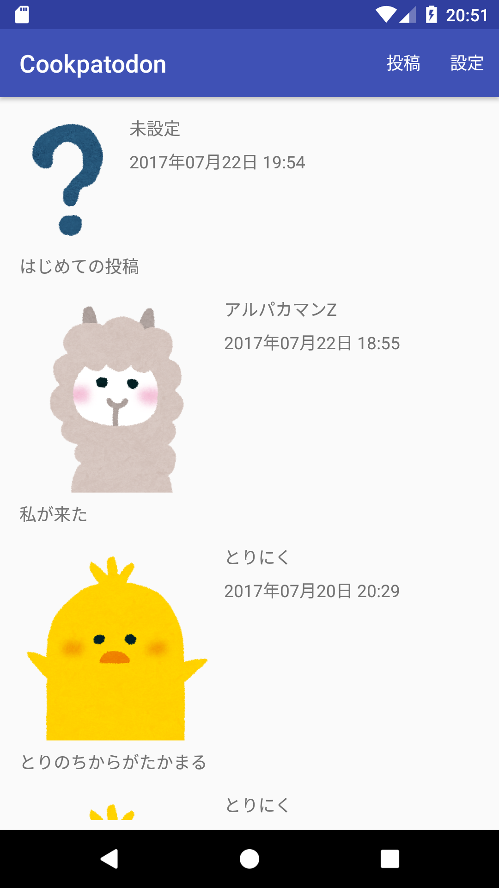
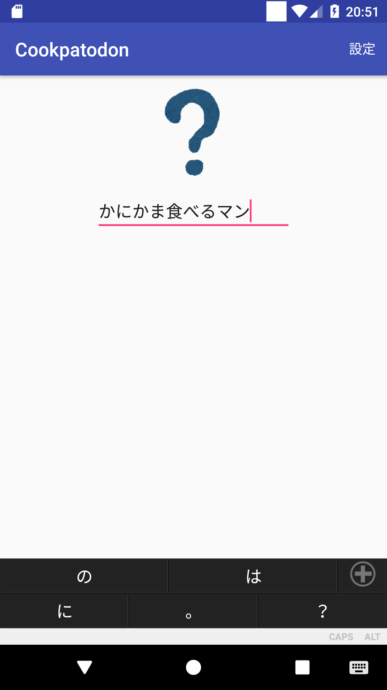
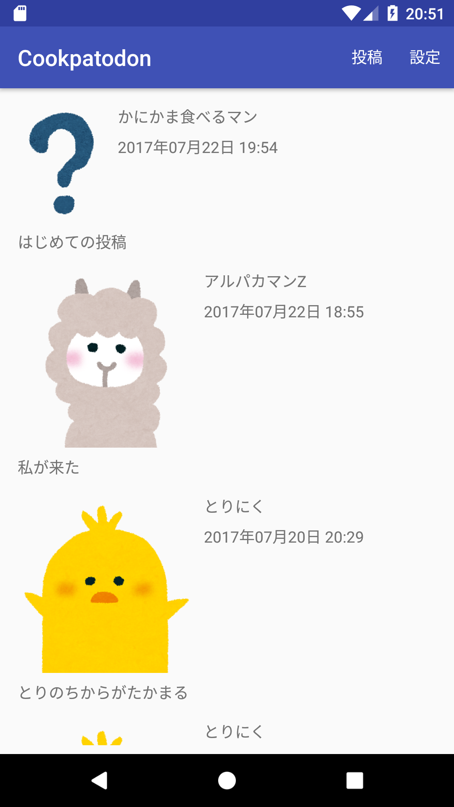
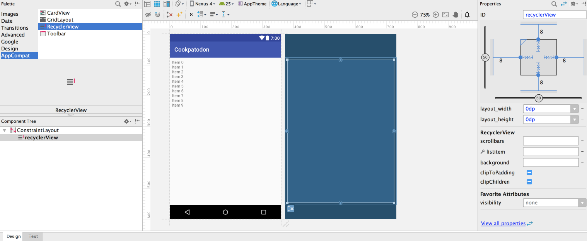
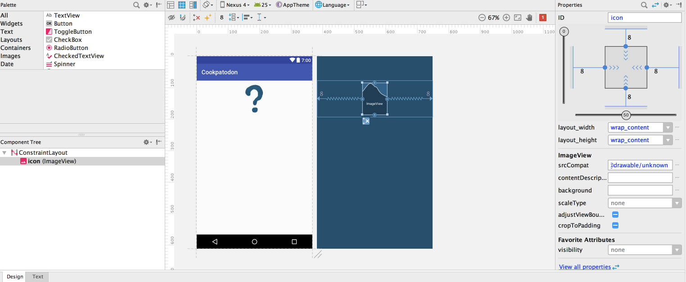
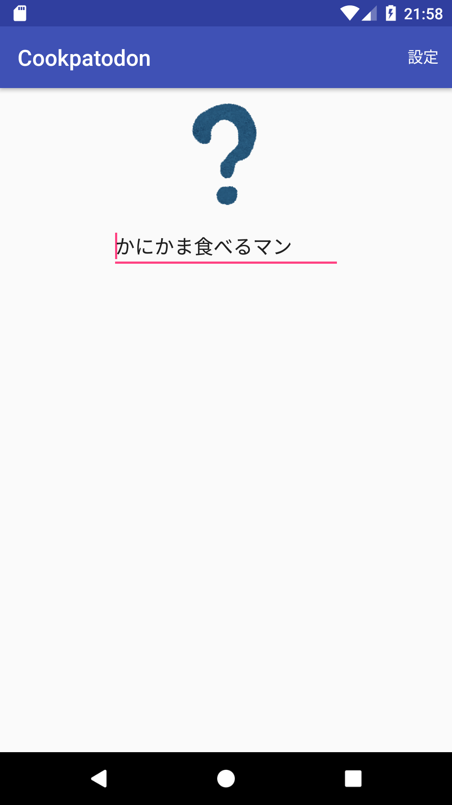
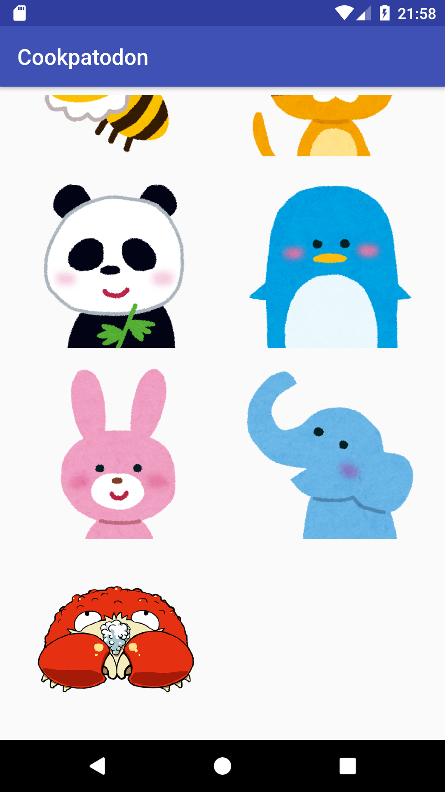
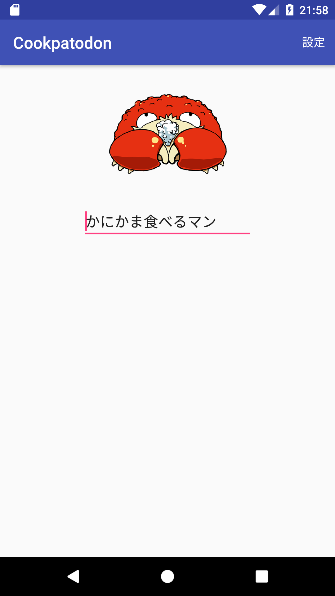
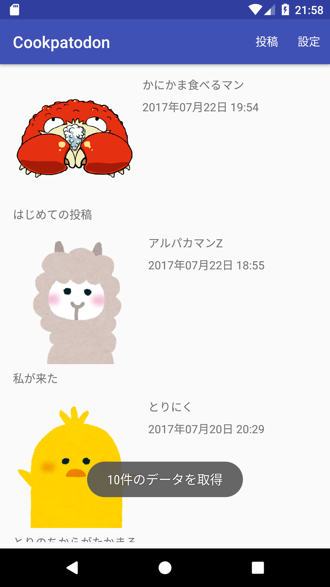

# ユーザー情報設定画面の実装

現在の仕様では全員が仮登録された情報で投稿するため、誰の投稿かわからない状態です。
ユーザー名の入力とユーザーアイコンの選択によって`/users/$uid` 以下の情報を更新し、ユーザー名とユーザーアイコンを変更できる画面を作ってみましょう。

## 設定画面の作成

[lesson06](06-implement_post_message.md)の変更を振り返りながら、以下のような画面を追加してみましょう。

- `SettingActivity`の追加
    - `activity_setting` レイアウトファイルの追加(必要があれば)
    - `AndroidManifest` への`SettingActivity`情報の追記(必要があれば)
- `setting_menu.xml` メニューリソースの追加
    - `main_menu.xml` は `id:setting`、`title:設定`、`showAsAction:always`のメニューを持つ

`activity_setting`のレイアウトは以下のような構成にします。

- `avatar` という id の `ImageView` を追加する
    - 初期アイコンは `unknown` を選択します
    - 上端、左端、右端をそれぞれ画面の上端、左端、右端に接続する
- `name` という id の `EditText` を追加する
    - `Text -> Plain Text` を利用する
    - 上端を `avatar` の下端に接続する
    - 左端、右端をそれぞれ画面の左端、右端に接続する

以下のような表示になっていれば成功です。



## ユーザー名の設定

まずはユーザー名を設定できる状態にしていきます。
`PostActivity`同様、`SettingActivity`の`onCreate()`でユーザー情報を取得します。
このとき、取得したユーザー名を `name EditText` に設定してみましょう。


```java
public class SettingActivity extends AppCompatActivity {

    // 投稿時に使うユーザー情報
    private User user;

    // データベースへの接続を設定
    private DatabaseReference reference = FirebaseDatabase.getInstance().getReference();

    @Override
    protected void onCreate(Bundle savedInstanceState) {
        super.onCreate(savedInstanceState);
        setContentView(R.layout.activity_setting);

        // ログインユーザーのUID
        String uid = FirebaseAuth.getInstance().getCurrentUser().getUid();

        // ユーザー情報を /users/$uid から取得
        reference.child("users").child(uid).addListenerForSingleValueEvent(new ValueEventListener() {
            @Override
            public void onDataChange(DataSnapshot dataSnapshot) {
                // ユーザー情報を取得
                user = dataSnapshot.getValue(User.class);

                // ユーザー名を EditText に設定
                ((EditText)findViewById(R.id.name)).setText(user.name);
            }

            @Override
            public void onCancelled(DatabaseError databaseError) {

            }
        });
    }
}
```

次に、`setting_menu`のメニューを読み込むように設定し、「設定」ボタン押下時に `name` の情報を元にデータベースの更新を行うようにします。
[lesson02](02-firebase.md) で紹介し、[lesson06](06-implement_post_message.md)実装したとおり、`/users/$uid/posts` 以下には過去の投稿の ユニークkey一覧が格納されています。
このユニークkeyをもとに、`/posts`以下の過去の投稿も簡単に更新することができます。

```java
@Override
public boolean onCreateOptionsMenu(Menu menu) {
    // setting_menu で定義したメニューを画面に追加
    getMenuInflater().inflate(R.menu.setting_menu, menu);
    return super.onCreateOptionsMenu(menu);
}

@Override
public boolean onOptionsItemSelected(MenuItem item) {

    // 選択されたメニューアイテムの id が setting であれば設定メニュー
    if (item.getItemId() == R.id.setting) {

        // もし name が未入力であれば何もしない
        EditText nameEditText = (EditText) findViewById(R.id.name);
        if (TextUtils.isEmpty(nameEditText.getText())) {
            // body が未入力なので何もせず終了
            return false;
        }
        String name = nameEditText.getText().toString();

        String uid = FirebaseAuth.getInstance().getCurrentUser().getUid();

        reference.child("users").child(uid).child("name").setValue(name);

        // /users/$uid/posts 以下に格納されている投稿一覧から過去の投稿を更新
        if (user.posts != null){
            for (String pid : user.posts.keySet()) {
                // /posts/$pid/authorName を更新
                reference.child("posts").child(pid).child("authorName").setValue(name);
            }
        }

        // 設定できたら画面を終了
        finish();
        return true;
    }

    return super.onOptionsItemSelected(item);
}
```

ここまでできたら `MainActivity` から `SettingActivity`を起動する処理を実装してみましょう。

- `main_menu.xml` にメニューを追加する
    - `id:setting`、`title:設定`、`showAsAction:always`のメニューを追加
- `MainActivity` の `onOptionsItemSelected()` で `R.id.setting`メニューを処理する
    - `SettingActivity` を起動する

ここまでの修正で、過去の投稿も含めた現在のユーザー名が変更できるようになりました。
さっそくビルドしてユーザー名の変更を行ってみましょう。

|MainActivity|SettingActivity|MainActivty(再)|
|:---:|:---:|:---:|
||||

自分の投稿(一番上)のユーザー名が「かにかま食べるマン」になっているのがわかるでしょうか？
皆さんの手元では「未設定」さんが複数いてそれぞれ投稿していた状態なので、[lesson06](lesson06.md)の最後に自分が投稿した内容のユーザー名が更新されていることを確認しましょう。

うまくいかない場合はスタッフや近くの人に聞いてみましょう。
この実装で発生しやすい問題と解決方法は以下です。

- 投稿一覧画面に設定メニューがない
    - `main_menu.xml` の記述を確認しましょう
- 投稿一覧画面に設定メニューが反応しない
    - `main_menu.xml` の記述を確認しましょう
    - `MainActivity` の onOptionsItemSelected() の実装内容を確認しましょう
- 設定画面に設定メニューがない
    - `setting_menu.xml` の記述を確認しましょう
    - `SettingActivity` の `onCreateOptionsMenu()` で `setting_menu` を inflate しているか確認しましょう
- 設定画面の設定メニューが反応しない
    - `setting_menu.xml` の記述を確認しましょう
    - `SettingActivity` の `onOptionsItemSelected()` の実装内容を確認しましょう

## アイコン選択

ユーザー名の変更ができたので、次はアイコンを変更してみましょう。
アイコンの変更はアイコン選択画面を新しく作成し、`RecyclerView`でアイコン一覧を表示して選べるようにします。

これまでの手順を参考に、以下の実装を進めてみましょう。

- `IconSelectActivity` の追加
    - `activity_icon_select.xml` レイアウトファイルの追加(必要があれば)
    - `AndroidManifest` への`IconSelectActivity`情報の追記(必要があれば)
- `activity_icon_select` に `RecyclerView` を追加
    - id は `recyclerView`
    - 上下左右を画面の上下左右に接続
    - recyclerView が画面全体に表示されている
- `item_icon.xml` レイアウトファイルの追加
    - Root Element は`ConstraintLayout`
    - id `icon`の`ImageView` を追加
    - `icon` の上下左右を画面の上下左右に接続
    - `ConstraintLayout` の `layout_height` を `wrap_content` に設定

`activity_icon_select.xml` のレイアウトは以下のようになります。



`item_icon.xml` のレイアウトは以下のようになります。



次に、`IconSelectActivity` に アイコン表示用の RecyclerView を設定しましょう。
今回はタイル状にアイコンを2列で並べたいので、`LinearLayoutManager`ではなく`GridLayoutManager`を利用します。
画像データは `ImageUtils.imageList` を参照して下さい。

```java
public class IconSelectActivity extends AppCompatActivity {

    @Override
    protected void onCreate(Bundle savedInstanceState) {
        super.onCreate(savedInstanceState);
        setContentView(R.layout.activity_icon_select);

        RecyclerView recyclerView = (RecyclerView) findViewById(R.id.recyclerView);
        // 2列に表示するレイアウトマネージャー
        GridLayoutManager gridLayoutManager = new GridLayoutManager(this, 2);
        recyclerView.setLayoutManager(gridLayoutManager);

        recyclerView.setAdapter(new Adapter());
    }

    class Adapter extends RecyclerView.Adapter<Adapter.ViewHolder> {

        @Override
        public int getItemCount() {
            // imageList の件数を返す
            return ImageUtils.imageList.length;
        }

        @Override
        public ViewHolder onCreateViewHolder(ViewGroup parent, int viewType) {
            // item_icon.xml のレイアウトを生成
            View view = getLayoutInflater().inflate(R.layout.item_icon, parent, false);

            // 生成したレイアウトをViewHolderに渡す
            return new ViewHolder(view);
        }

        @Override
        public void onBindViewHolder(ViewHolder holder, int position) {
            // 画像名を取得
            final String imageName = ImageUtils.imageList[position];

            // 画像を表示する処理
            holder.icon.setImageResource(ImageUtils.getDrawableResource(holder.icon.getContext(), imageName));
        }


        class ViewHolder extends RecyclerView.ViewHolder {

            // アイコン表示用のImageView
            ImageView icon;

            public ViewHolder(View itemView) {
                super(itemView);

                // アイテムViewにアクセスしやすいように変数にセット
                icon = (ImageView) itemView.findViewById(R.id.icon);
            }
        }

    }
}
```

これでアイコン一覧を表示する画面ができました。
しかし、アイコン一覧画面にはアイコン選択時の動作が書かれていません。
アイコン一覧画面でアイコン更新するためには、選択した画像を`SettingActivity`に通知する必要があります。

AndroidではこのようなAcitivty間のデータのやりとりに`Intent`を使います。
まずは `IconSelectActivity` 側で結果を返す処理を記述してみましょう。
今回は `IconSelectActivity` 内の `Adapter` で定義されている `onBindViewHolder()` メソッドに直接記述します。

```java
public class IconSelectActivity extends AppCompatActivity {

  // 処理結果 Intent に値を格納するための key
  public static final String EXTRA_IMAGE_NAME = "extra_image_name";

  ...

  class Adapter extends RecyclerView.Adapter<Adapter.ViewHolder> {

  ...

    @Override
    public void onBindViewHolder(ViewHolder holder, int position) {
        // 画像名を取得
        final String imageName = ImageUtils.imageList[position];

        // 画像を表示する処理
        holder.icon.setImageResource(ImageUtils.getDrawableResource(holder.icon.getContext(), imageName));


        holder.icon.setOnClickListener(new View.OnClickListener() {
            @Override
            public void onClick(View v) {

                // 選択された画像名を結果の Intent に格納
                Intent result = new Intent();
                result.putExtra(EXTRA_IMAGE_NAME, imageName);

                // 結果の Intent を設定
                setResult(Activity.RESULT_OK, result);

                // アイコン選択画面を終了
                finish();
            }
        });
    }
  }
}
```

これで  `IconSelectActivity` から処理結果を返せるようになりました。
呼び出し元の `SettingActivity` で処理結果を受け取るためには、`startActivityForResult()`というメソッドで画面遷移し、`onActivityResult()` で処理結果を受け取る必要があります。
`startActivityForResult()` では `startActivity()` と違い、`requestCode` という値を指定する必要があります。
`onActivityResult()` に処理結果が渡ってきた際、この `requestCode`によってどの画面遷移による処理化を判定し、`resultCode` によって処理が成功か失敗かを判定します。
では実際に `SettingActivity` から `IconSelectActivity`を呼び出す処理を書いてみましょう。

```java
public class SettingActivity extends AppCompatActivity {

  // アイコン表示用の startActivityForResult であることが区別できるようにするID
  private final int REQUEST_ICON_SELECT = 100;

  @Override
  protected void onCreate(Bundle savedInstanceState) {
      super.onCreate(savedInstanceState);
      setContentView(R.layout.activity_setting);

      // ログインユーザーのUID
      String uid = FirebaseAuth.getInstance().getCurrentUser().getUid();

      // ユーザー情報を /users/$uid から取得
      reference.child("users").child(uid).addListenerForSingleValueEvent(new ValueEventListener() {
          @Override
          public void onDataChange(DataSnapshot dataSnapshot) {
              // ユーザー情報を取得
              user = dataSnapshot.getValue(User.class);

              // ユーザー名を EditText に設定
              ((EditText) findViewById(R.id.name)).setText(user.name);

              // ユーザーアイコンを avatar に設定
              ImageView avatar = (ImageView) findViewById(R.id.avatar);
              avatar.setImageResource(ImageUtils.getDrawableResource(avatar.getContext(), user.avatarName));

              // ユーザーアイコンの名前を avatar のタグに設定
              // タグを利用するとそのViewの表示内容にまつわる情報を保存できて便利です
              avatar.setTag(user.avatarName);
          }

          @Override
          public void onCancelled(DatabaseError databaseError) {

          }
      });


      // avatar をクリックした時に IconSelectActivity を起動
      // 結果を受け取りたいので startActivityForResult する
      findViewById(R.id.avatar).setOnClickListener(new View.OnClickListener() {
          @Override
          public void onClick(View v) {
              Intent intent = new Intent(v.getContext(), IconSelectActivity.class);
              startActivityForResult(intent, REQUEST_ICON_SELECT);
          }
      });
  }

  ...

  @Override
  protected void onActivityResult(int requestCode, int resultCode, Intent data) {

      // アイコン選択画面への遷移 かつ アイコン選択時のみ処理
      // backボタンで戻ったときなどは resultCode が RESULT_OK にならないため処理されません
      if (requestCode == REQUEST_ICON_SELECT && resultCode == Activity.RESULT_OK) {
          // IconSelectActivity で保存した画像名を取得
          String avatarName = data.getStringExtra(IconSelectActivity.EXTRA_IMAGE_NAME);

          // 選択されたアイコンを avatar に設定
          ImageView avatar = (ImageView) findViewById(R.id.avatar);
          avatar.setImageResource(ImageUtils.getDrawableResource(avatar.getContext(), avatarName));

          // 選択されたアイコンの名前を avatar のタグに設定
          avatar.setTag(avatarName);
      }

      super.onActivityResult(requestCode, resultCode, data);
  }
}
```

ここまでの作業で選択されたアイコンが`avatar`のタグに保存されるところまで来ました。
最後に、`SettingActivity`の「設定」メニュー押下時のユーザー情報更新処理で、選択された画像情報も同時に更新するようにしてみましょう。


```java
public class SettingActivity extends AppCompatActivity {

  ...

  @Override
  public boolean onOptionsItemSelected(MenuItem item) {

      // 選択されたメニューアイテムの id が setting であれば設定メニュー
      if (item.getItemId() == R.id.setting) {

          // もし name が未入力であれば何もしない
          EditText nameEditText = (EditText) findViewById(R.id.name);
          if (TextUtils.isEmpty(nameEditText.getText())) {
              // body が未入力なので何もせず終了
              return false;
          }
          String name = nameEditText.getText().toString();

          String uid = FirebaseAuth.getInstance().getCurrentUser().getUid();

          reference.child("users").child(uid).child("name").setValue(name);

          // avatar のタグから画像名取り出し
          String avatarName = findViewById(R.id.avatar).getTag().toString();
          // ユーザーのアイコンを更新
          reference.child("users").child(uid).child("avatarName").setValue(avatarName);

          // /users/$uid/posts 以下に格納されている投稿一覧から過去の投稿を更新
          for (String pid : user.posts.keySet()) {
              // /posts/$pid/authorName を更新
              reference.child("posts").child(pid).child("authorName").setValue(name);
              // /posts/$pid/authorAvatar を更新
              reference.child("posts").child(pid).child("authorAvatar").setValue(avatarName);
          }

          // 設定できたら画面を終了
          finish();
          return true;
      }

      return super.onOptionsItemSelected(item);
  }

  ...

}
```

ここまでできればアイコンの更新ができるようになっているはずです。
実際にビルドして、エミュレータで実行してみましょう。

|MainActivity|SettingActivity|IconSelectActivity|SettingActivity(再)|MainActivity(再)|
|:---:|:---:|:---:|:---:|:---:|
||||||

アイコンを変更後に「設定」メニューを選択すると、過去の投稿も含めてアイコンが変更されると思います。


うまくいかない場合はスタッフや近くの人に聞いてみましょう。
この実装で発生しやすい問題と解決方法は以下です。

- 設定画面からアイコン選択画面に遷移できない
    - SettingActivity のクリック処理を確認しましょう
- アイコン選択画面でアイコンを選択しても前の画面に戻らない
    - IconSelectActivity の Adapter 内の処理を確認しましょう
- アイコン選択画面でアイコンを選択しても設定画面に適用されない
    - `IconSelectActivity` の Adapter 内の処理を確認しましょう
    - `SettingActivity` の `onActivityResult()` 処理を確認しましょう
- 設定画面で設定してもアイコンの変更が反映されない
    - `SettingActivity` の `onOptionsItemSelected()` の実装内容を確認しましょう

## ここまでできた人へ

以上で Android アプリ(基本編) は終了です。
ここまで実装できれば「サーバレスアーキテクチャのソーシャル・ネットワーキング・サービス作ったことあります」と言うことができるので、ぜひ自慢してください。

余裕のある人は発展課題を用意したので挑戦してみましょう。
[発展課題01](08-advanced_colorize_mentioned_message.md)
[発展課題02](09-advanced_characters_counter.md)
[発展課題03](10-advanced_share_url.md)
[発展課題04](11-advanced_user_list.md)
[発展課題05](12-advanced_post_list_by_user.md)

最後にできたところまでGitHub Enterprise にpushするのを忘れないようにして下さい。
