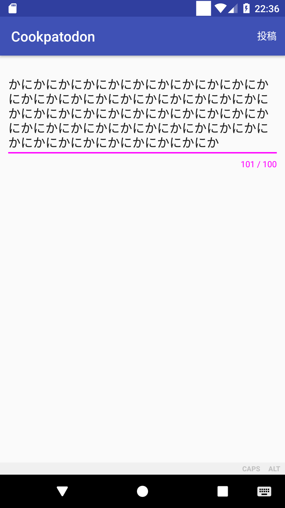
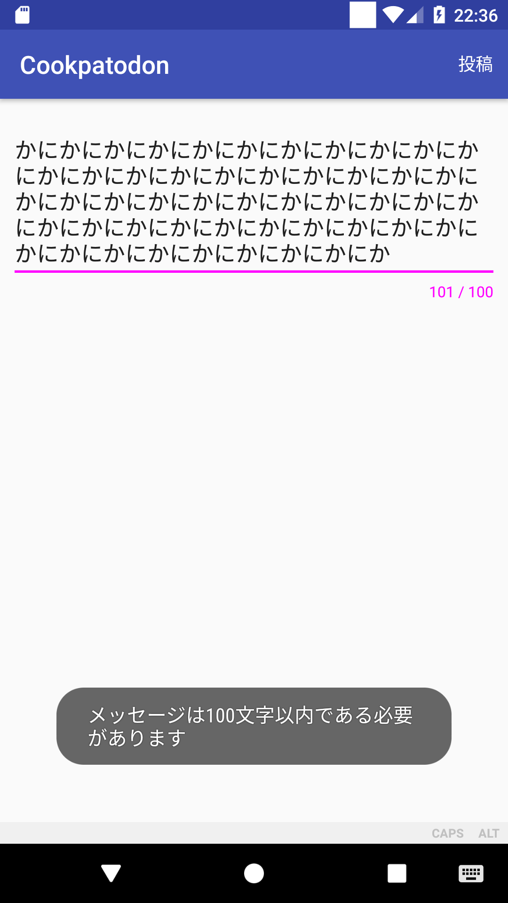

# 発展課題2 文字数カウンタを実装する

投稿画面に入力文字数のカウンタをつけてください。

- 入力文字に応じてリアルタイムにカウンタの値が変わるようにしてください
- 最大文字数は 100 としてください
- 入力文字列長を100から減算した値を表示します
- 100文字を超えたメッセージを投稿しようとした時にはエラーメッセージを表示してください

## 画面例

|入力中|エラーメッセージ|
|:---:|:---:|
|||

## ヒント

- `EditText` には入力されている文字列が変化したときのイベントを受け取るリスナーを設定できます
− エラーメッセージの表示は `Toast` が便利です
- `EditText` の代わりに `Design -> TextInputLayout` を使う方法もあります
    - 使い方が `EditText`とかなり違うので、自分で調べられる場合のみ挑戦してみてください
