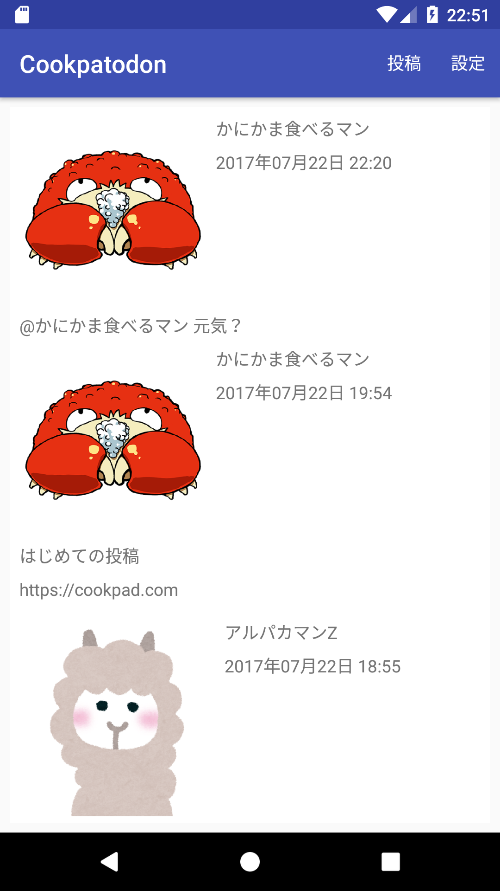
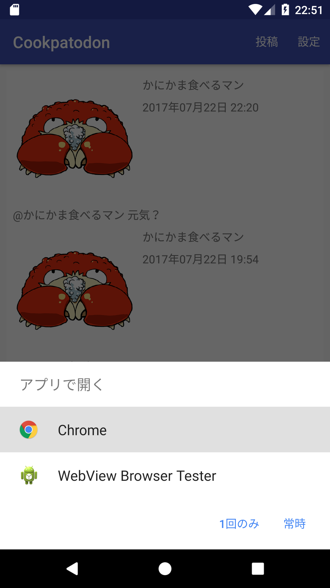
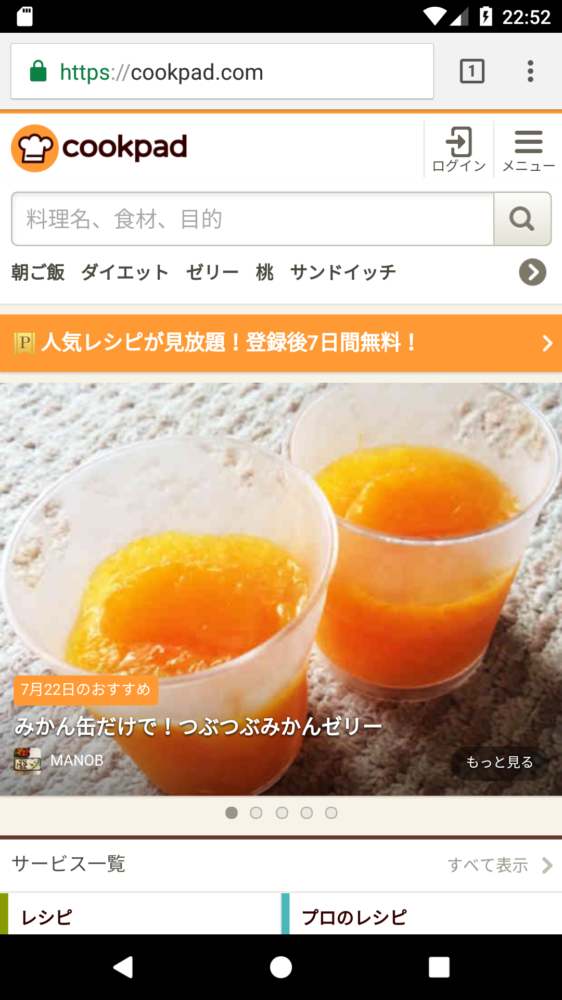
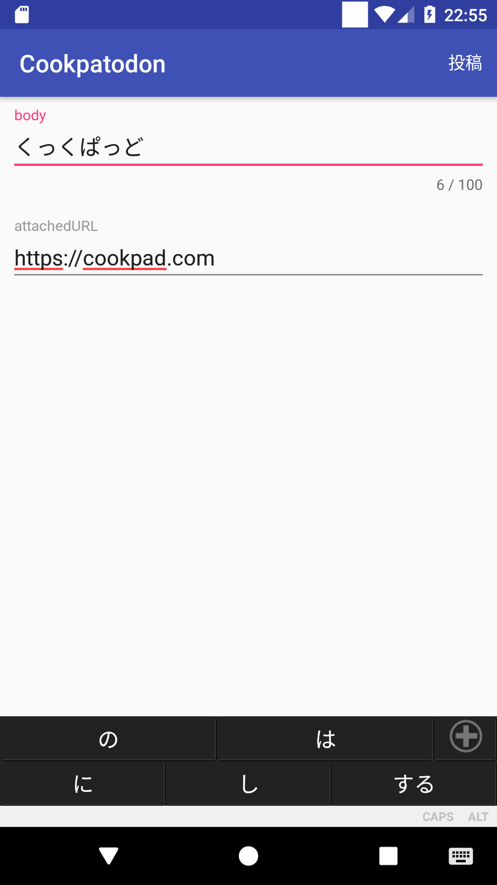
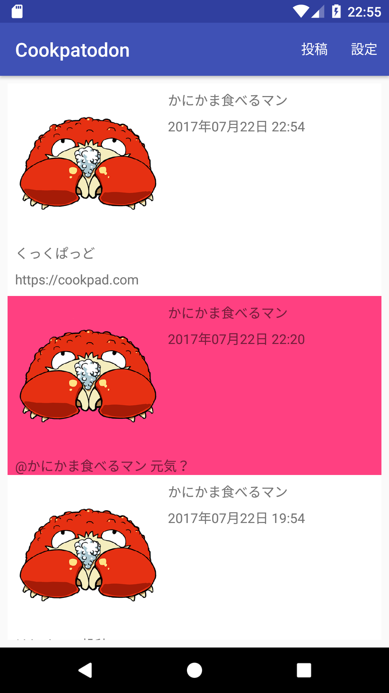

# 発展課題3 共有したいURLを含めた投稿に対応する

投稿に付加情報としてURLを付与して共有できるようにしてください。

- URL付き投稿の表示に対応してください
- URL付き投稿のアイテムViewをクリックするとブラウザでそのURLを表示できるようにしてください
- 投稿画面にURLを付与できるような機能を追加して下さい
- 投稿にURLを含める場合は `attachedURL` という key で URL の文字列を含め Firebase に保存するようにして下さい。

## 画面例

|投稿一覧|クリック時|ブラウザ表示時|
|:---:|:---:|:---:|
||||

|投稿画面|投稿一覧|
|:---:|:---:|
|||

## ヒント

- Postクラスで `attachedURL` を解釈できるようにする必要があります
- アイテムView全体のクリックリスナは`ViewHolder.itemView.setOnClickListener()`で設定できます
- RecyclerによるアイテムViewのリサイクルは listener の設定も引き継ぐので気をつけましょう
- URLを開くIntentの作り方は Intent クラスのリファレンスを見たりググったりして調べましょう
