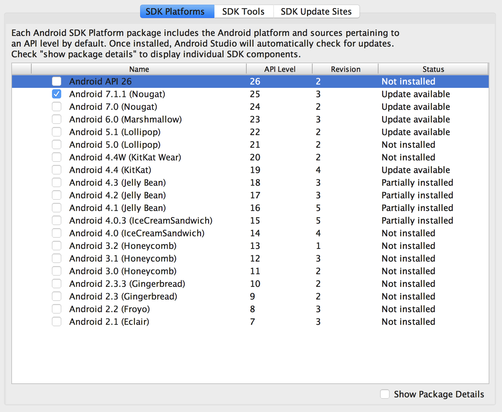
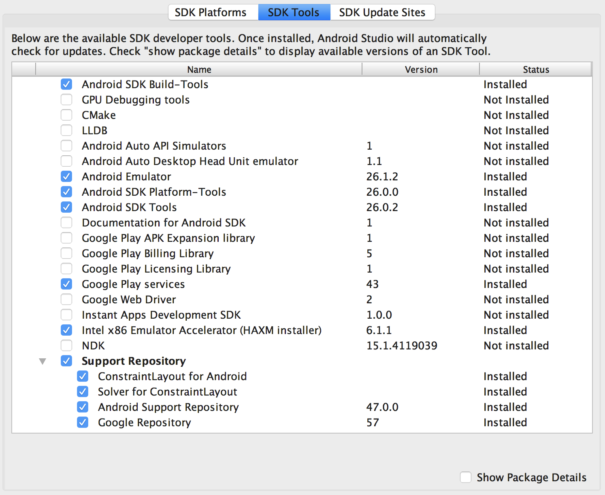

- [Android Studio](https://developer.android.com/studio/index.html) がインストールされている
    - 資料執筆時の最新バージョンである v2.3.3 を想定しています
- 以下のコンポーネントがインストールされている
    - SDK Platforms -> Android 7.1.1 (Nougat)
    - SDK Tools -> Android SDK Build-Tools
    - SDK Tools -> Android Emulator
    - SDK Tools -> Android SDK Platform-Tools
    - SDK Tools -> Android SDK Tools
    - SDK Tools -> Google Play Services
    - SDK Tools -> Intel x86 Emulator Accelerator(HAXM installer)
    - SDK Tools -> Support Repository 以下のすべて

コンポーネントのインストールはAndroid Studio 起動後、右下の Configure -> SDK Manager から行えます
必要なコンポーネントが揃っている場合、以下のようになります





---

リハーサルの結果、エミュレータのシステムイメージがダウンロード済みでないと時間がかかりすぎることがわかりました。
以下のコマンドで必要なシステムイメージのダウンロードをお願いします。

```
sdkmanager "system-images;android-25;google_apis;x86"
```

`sdkmanager` コマンドは AndroidSDK インストール先の `tools/bin` ディレクトリにあります。
Android Studio標準の構成では `~/Library/Android/sdk//tools/bin/` です。
↑のコマンド実行時、ライセンスに関する確認が表示されるかもしれません。もし表示された場合は`yes`で続行してください。

また、 Intel HAXM の最新版がインストールされていないとDockerとAndroidエミュレータが同時に起動できないので、以下のコマンドを実行して Intel HAXM のインストールをお願いします。
`$ANDROID_SDK` は通常 `~/Library/Android/sdk/` です。

```
sudo $ANDROID_SDK/extras/intel/Hardware_Accelerated_Execution_Manager/silent_install.sh
```
