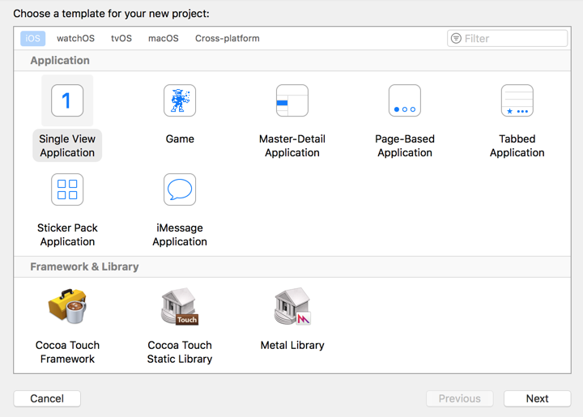
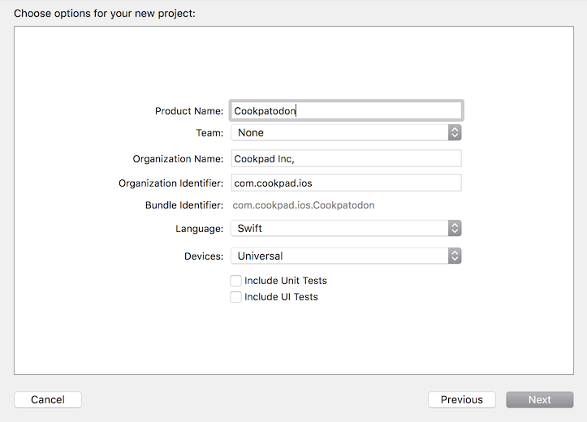
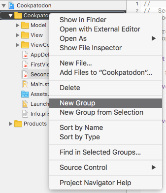
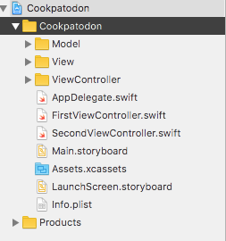
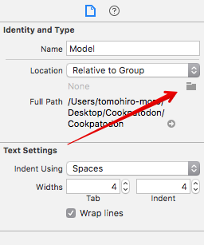

# 講義1 プロジェクトの作成

iOS アプリを開発するためのプロジェクトを作成します。
プロジェクトの名前は **Cookpatodon** とします。

以下の手順で進めます。

- Tabbed Application テンプレートでプロジェクトを作成する
- プロジェクトに `Model`, `View`, `ViewController` の3つのグループを作る
- 作成したグループそれぞれを同名のディレクトリに関連付ける

## Tabbed Application テンプレートでプロジェクトを作成する

Xcode の `File > New > Project...` からプロジェクトを作成し、テンプレートを選択します。



プロダクト名などを入力します。言語は Swift を選択します。
ここで Bundle Identifier が **com.cookpad.ios.Cookpatodon** となるようにしてください



## プロジェクトに `Model`, `View`, `ViewController` の3つのグループを作る

左ペインの Project グループを右クリックし、`New Group` を選択して新しいグループを作ります。



それぞれのグループを作り終わると図のような状態になります。



## 作成したグループそれぞれを同名のディレクトリに関連付ける

ひとつのグループを選択した状態で右ペインを見ると図のような状態になっています。
ここの `None` の横のフォルダのアイコンをクリックすると、グループに対応しているディレクトリを選択することができます。



## iOS プロジェクト用の .gitignore ファイルを配置する

iOS プロジェクトには様々なファイルが含まれますが、なかには git で版管理する必要のないファイルも存在します。
そのため、不要なファイルをコミットへ含めないように .gitignore ファイルを配置しましょう。

github.com に Swift プロジェクト用の .gitignore テンプレートがあるのでこれを利用します。
https://github.com/github/gitignore/blob/master/Swift.gitignore

このファイルの内容をコピーし、プロジェクトディレクトリへ .gitignore ファイルとして配置してください。
また、このファイルを編集して、コメントアウトされている以下の行の頭の # を削り、この指定を有効にしてください

```
# Pods
```

## アプリをビルドしてみる

ここまでできたところで一度アプリをビルドしてみましょう。
Xcode 左上の再生ボタンのようなボタンをクリックすると、アプリのビルドを行い、iOS シミュレータでアプリが起動します。
`⌘+R` でもアプリのビルドと実行を行えます。