# 講義3 画面要素の配置

この回では、 **投稿一覧画面** に並べて表示するセルの設定を行います。

Storyboard 上で、投稿されたメッセージを表示するセルを設定します。
設定が終わると以下の画像のようになります。

## PostCell クラスのファイルを作成する

View グループの下に `PostCell` クラスのファイルを作成します。
`PostListViewController.swift` を作成した時と同様の操作をしてください。
その際に `UITableViewCell` のサブクラスとして作成してください。

ファイルが作成できたら Storyboard 上のセルを選択し、Custom Class の項目に作成したクラスを指定します。

また、つまみのようなタブに切り替えて、ReuseIdentifier に `PostCell` を指定してください。この値は次の回で使います。

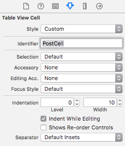

## セルの高さを変更する

投稿メッセージを表示するセルの高さは最低 **80** point とすることにします。
投稿一覧画面の TableView を選択し、右ペインの TableView セクションの Row height の項目の値を **80** に設定します。

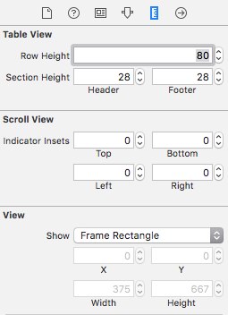

Row height の値を設定すると Storyboard 上の表示の高さも大きくなります。

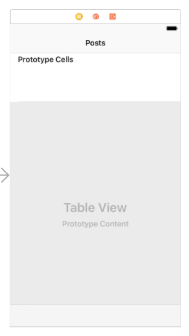

## ラベルなどの要素の配置指定

今回設定するセルには以下の要素を配置する必要があります。

- 投稿者のアバター画像を表示する ImageView (avatarImageView)
- 投稿者名を表示する Label (authorNameLabel)
- 投稿時間を表示する Label (createDateLabel)
- 投稿の本文を表示する Label (bodyLabel)

それぞれの要素は以下のように配置します。

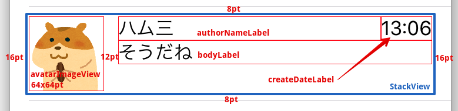

## 画像やラベルなどの要素を配置する

iOS には AutoLayout という、要素のサイズや要素間の間隔に対し制約を指定することでレイアウトを表現する仕組みがあります。
iOS 端末には複数の画面サイズや表示方向（Portlait/Landscape）があるので、画面サイズが違っても適切に要素が配置されるようにこの仕組みが用意されています。

また、StackView という画面要素を順に並べることでレイアウトを行う部品があります。
これから Storyboard 上で Label や ImageView を配置してしていきます。

### StackView の配置

まず、画面要素を配置するための大元の StackView を追加します。
上記のレイアウトを実現するために以下のような StackView の木構造を作ってレイアウトします

- StackView (青)
    - avatarImageView
    - StackView (緑)
        - StackView (橙)
            - authorNameLabel
            - createDateLabel
        - bodyLabel

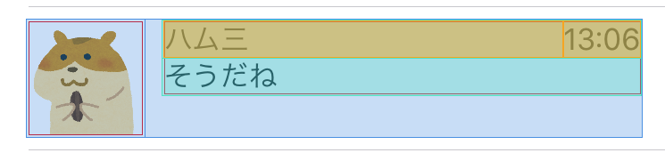

右ペイン下部から HorizontalStackView を選択し、セルにドラッグアンドドロップします。

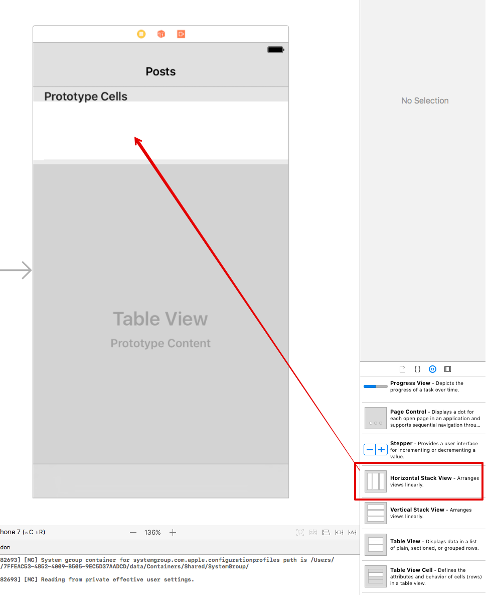

ドラッグアンドドロップしただけでは意図したところに表示できないので制約を追加します。
ImageViewの大きさと上左のマージンを指定します。以下の画像のように設定してください。

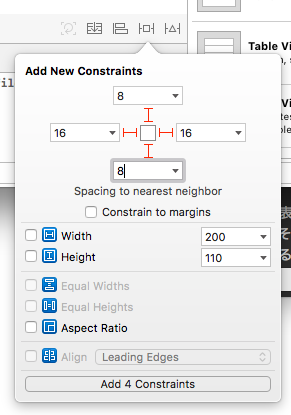

制約の設定ができると、それに合わせて追加したStackViewのレイアウトが変わります。

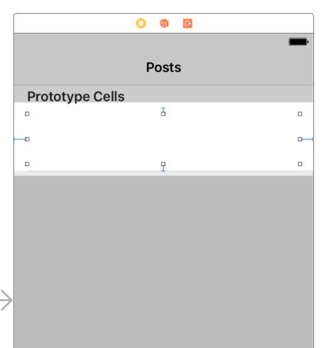

最後に StackView の alignment を `Top` に変更します。Spacing にも `12` を指定してください。

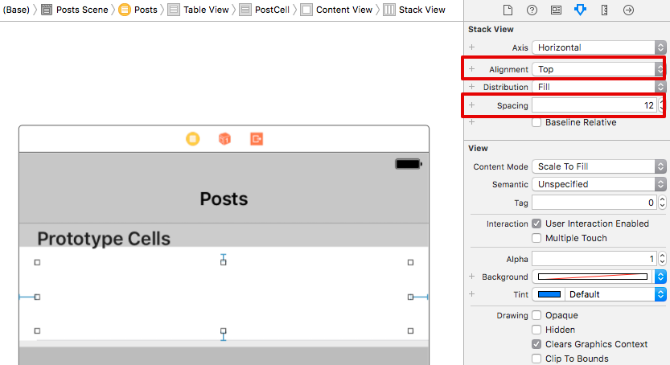

### ImageView の配置

次に画像を表示できるようにします。画像を表示するには ImageView という部品を使います。先程と同じように右ペイン下部から ImageView を選択し、先程追加したStackViewにドラッグアンドドロップします。

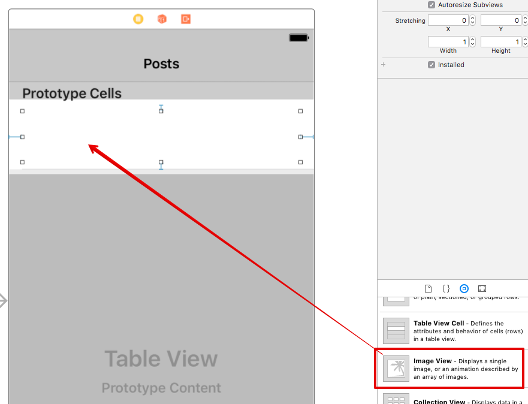

ImageView に対しても制約を追加します。
ImageViewの大きさを指定します。以下の画像のように設定してください。

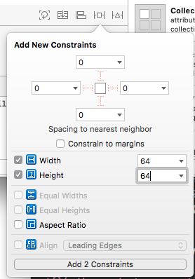

ImageView を追加したら、右ペインの View の設定のところで Content Mode を `AspectFit` に切り替えてください。これにより、アスペクト比を保ったままImageViewの大きさに合わせて画像をリサイズして表示してくれます。

### Label の配置

次に投稿者名や投稿時間、本文を表示するラベルを配置します。

ImageView の隣に VerticalStackView を追加します。
その中に更に HorizontalView や Label を追加して、前述した木構造ができるようにしてください。

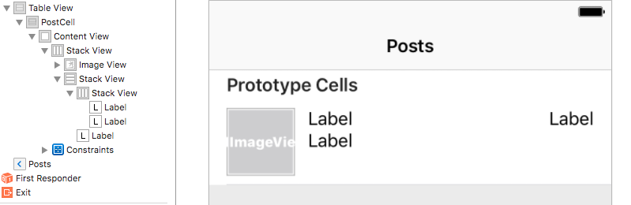

ラベルが複数あるとわかりにくいので Label に表示するテキストを仮に入れておくと区別がつけやすくなります。ラベルをダブルクリックすると表示文字列を変更できます。

bodyLabel のみ、複数行に対応させる必要があるので lines の値を 0 にしてください。

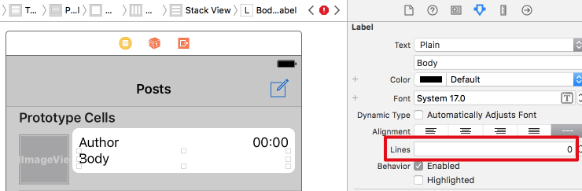

3つのラベルを追加すると警告がでています。これは HorizontalStackView に追加した2つのラベルのうち、どちらを優先して表示すべきか iOS がわからないことを示しています。
そのため時刻を表示するラベルの方の設定を変更し、こちらを優先的に表示する設定を行います。

以下の画像のように、時刻表示ラベルを選択した状態で定規のようなタブを選択すると `ContentHuggingPriority` の設定項目が出てくるので Horizontal の値をデフォルトの `251` から `252` に変更してください。この数値が大きいほど優先してくれます。

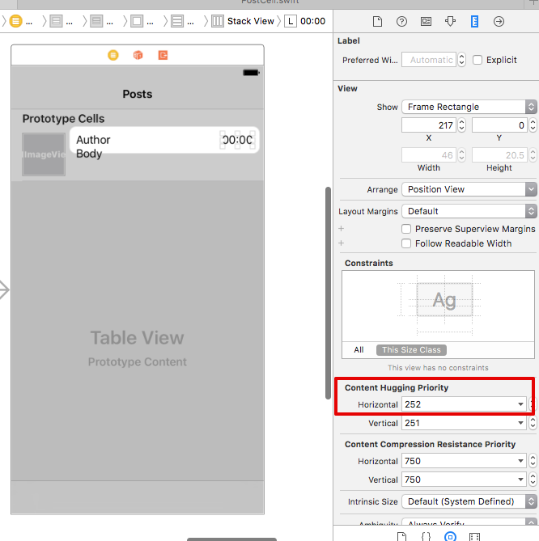

ここまでの設定がすべてうまくいっていると、以下のような状態になります。

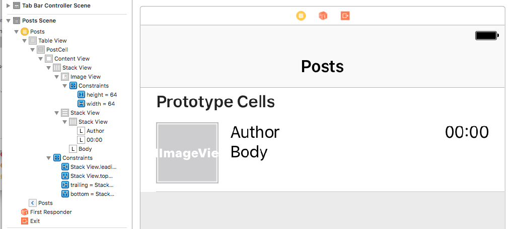

## クラスとセルの要素を結びつける

画像とラベルの配置ができたらこれらの要素をコードから参照できるように設定します。

画面右上部の円が重なっているようなアイコンのボタンを押して AssistantEditor を表示するようにすると Storyboard の画面とコードエディタを同時に表示できるようになります。エディタの上部でファイルが選択できるので、以下の画像の様に辿って `PostCell.swift` を表示します。

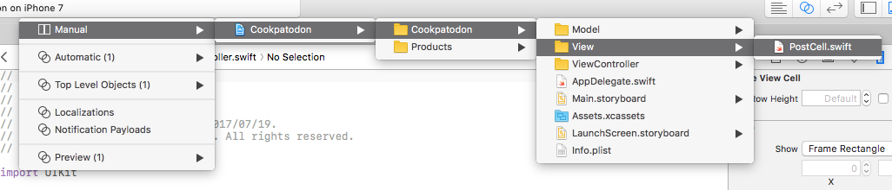

Storyboard 上の imageView を選択した状態から Ctrl を押したままドラッグすると青い線が出ます。

この青い線を右側のソースコード上に落とすと、以下の画像の様に PostCell のメンバ変数と要素の接続の設定ができるダイアログが表示されるので、名前をつけてメンバ変数を追加します。
imageView は `avatarImageView` という名前にします。

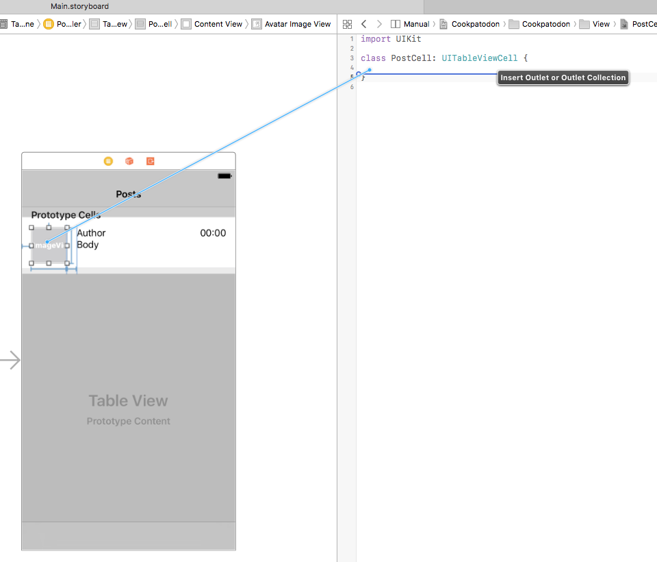
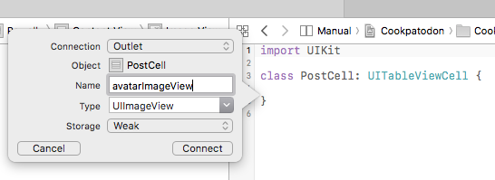

同様に他のラベル群に対しても設定を行うと、それぞれの要素にコードから参照できるようになります。
このような状態になれば完成です。

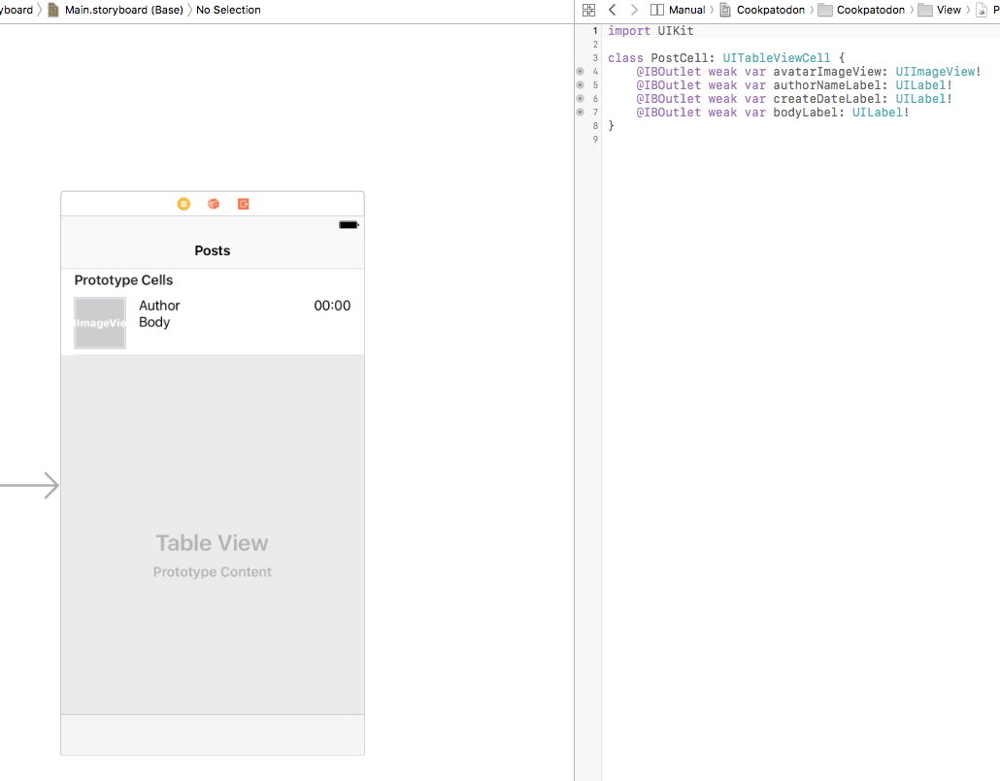