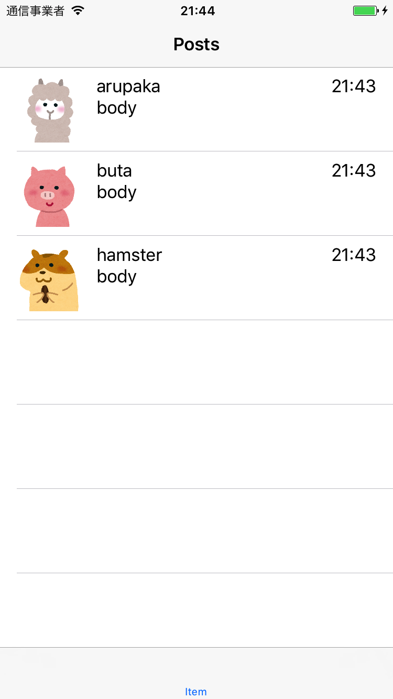

# 講義4 TableView によるリストの表示

セルの設定ができたので、このセルにメッセージを表示します。

## アバター画像をダウンロードする

まず、投稿者のアバターとして表示する画像ファイルをダウンロードしてきます。
以下のスクリプトを Cookpatodon プロジェクトのディレクトリに `download_icons.rb` というファイル名で保存してください。

```ruby
require 'fileutils'
require 'open-uri'

links = {
  unknown: 'http://4.bp.blogspot.com/-toaP1vMGZAM/UNbkIddJNqI/AAAAAAAAJTk/MeuaawYOaLw/s1600/mark_question.png',
  arupaka: 'http://4.bp.blogspot.com/-7DLdBODmEqc/VCIitQRzAWI/AAAAAAAAmeY/g1fjm8NqyaI/s800/animal_arupaka.png',
  buta: 'http://3.bp.blogspot.com/-2VIWJTc7MBs/VCIiteBs3wI/AAAAAAAAmec/BkjJno4Qh5U/s800/animal_buta.png',
  hamster: 'http://3.bp.blogspot.com/-n0PpkJL1BxE/VCIitXhWwpI/AAAAAAAAmfE/xLraJLXXrgk/s800/animal_hamster.png',
  hiyoko: 'http://1.bp.blogspot.com/-4N2T5W6jo_o/VCIiuUHNwEI/AAAAAAAAmeo/_lyIGo3afK4/s800/animal_hiyoko.png',
  inu: 'http://1.bp.blogspot.com/-FfjY4DibSI4/VCIiuxKtLRI/AAAAAAAAmes/40lCg_r9U2g/s800/animal_inu.png',
  kuma: 'http://2.bp.blogspot.com/-dvDN3SxnRWE/VCIivNhugVI/AAAAAAAAmew/sEC6XC1sGwk/s800/animal_kuma.png',
  mitsubachi: 'http://3.bp.blogspot.com/--IJXuiGRidY/WNir5IfLk3I/AAAAAAABC28/81L3mxcIe9EoqcK9uqCXbVxZ4YO36JzlQCLcB/s800/animal_mitsubachi.png',
  neko: 'http://1.bp.blogspot.com/-LFh4mfdjPSQ/VCIiwe10YhI/AAAAAAAAme0/J5m8xVexqqM/s800/animal_neko.png',
  neko2: 'https://github.com/giginet.png',
  panda: 'http://4.bp.blogspot.com/-xHGCCaOsEIU/VCIixHoXZTI/AAAAAAAAmfQ/Ek3BjRbafrQ/s800/animal_panda.png',
  penguin: 'http://4.bp.blogspot.com/-CtY5GzX0imo/VCIixcXx6PI/AAAAAAAAmfY/AzH9OmbuHZQ/s800/animal_penguin.png',
  usagi: 'http://2.bp.blogspot.com/-uLsKgsN9njE/VCIix1WrktI/AAAAAAAAmfU/SloY2fZacmo/s800/animal_usagi.png',
  zou: 'http://2.bp.blogspot.com/-81gQBAcgSEc/VCIi95CkyYI/AAAAAAAAmhw/z9DvwU2vvmM/s800/icon_others_08.png',
  kani: 'https://github.com/nein37.png',
}

images_path = File.expand_path('../images', __FILE__)

FileUtils.mkdir_p(images_path)
Dir.chdir(images_path) do
  links.each do |name, url|
    file_name = "#{name}.png"
    FileUtils.copy(open(url).path, file_name)
    FileUtils.chmod(0644, File.join(images_path, file_name))
  end
end
```

このスクリプトを実行すると、[いらすとや](http://www.irasutoya.com/2013/10/blog-post_9165.html)から動物たちの画像が `images` ファイルにダウンロードされます。

```sh
> ruby download_icons.rb
```

## アバター画像をプロジェクトに追加する

ダウンロードした画像ファイルをプロジェクトに追加します。
Xcode で `Assets.xcassets` というファイルを開き、ここに先程ダウンロードした画像ファイルをドラッグアンドドロップします。
これでプロジェクトへの画像ファイルの追加ができました。

## Post モデルを作る

`Post.swift` を Model グループ下に作ります。ファイルテンプレートは **Swift File** を選択してください。
このファイルに以下のように記述して、Post 構造体を定義します。

```swift
import Foundation

struct Post {
    let id: String
    let author: String
    let authorName: String
    let authorAvatar: String
    let body: String
    let createDate: Date
}
```

## PostCell を実装する

`PostCell` クラスに渡した Post モデルの値をラベルなどに設定するメソッド `func update(post: Post)` を実装します。

iOS SDK で画像は `UIImage` クラスで表現されます。先程追加した `arupaka`、`buta` などの画像は `UIImage(named: "arupaka")` というようなコードで画像ファイル名から UIImage クラスのインスタンスを生成できます。 ImageView の `image` プロパティにこのインスタンスをセットすることで画像を表示できます。

Label には `text` プロパティに文字列を指定することで文字を表示できます。 `update` メソッドでは Post 構造体のプロパティの値をそれぞれのラベルや ImageView に設定します。

時刻を表現する Date クラスはそのままではラベルに表示することができません。
そのため、DateFormatter というクラスを使って時刻をどのような形式の文字列に加工するかを表現し、それを用いて文字列に変換します。
ここでは、`hh:mm` という形式で表示したいのでその実装をしています。

```swift
class PostCell: UITableViewCell {
    static let height: CGFloat = 80
    static let dateFormatter: DateFormatter = {
        let formatter = DateFormatter()
        formatter.locale = Locale(identifier: "ja")
        formatter.dateFormat = "HH:mm"
        return formatter
    }()

    @IBOutlet weak var avatarImageView: UIImageView!
    @IBOutlet weak var authorNameLabel: UILabel!
    @IBOutlet weak var createDateLabel: UILabel!
    @IBOutlet weak var bodyLabel: UILabel!

    func update(post: Post) {
        avatarImageView.image = UIImage(named: post.authorAvatar)
        authorNameLabel.text = post.authorName
        createDateLabel.text = PostCell.dateFormatter.string(from: post.createDate)
        bodyLabel.text = post.body
    }
}
```

## ViewController で Post モデルの配列を作る

`PostListViewController` のメンバ変数 `posts` を追加します。
ここに先ほど定義した `Post` モデルをいくつか要素として代入します。

```swift
class PostListViewController: UITableViewController {
    var posts: [Post] = [
        Post(
            id: "aaa",
            author: "arupaka",
            authorName: "arupaka",
            authorAvatar: "arupaka",
            body: "body",
            createDate: Date()
        ),
        Post(
            id: "bbb",
            author: "buta",
            authorName: "buta",
            authorAvatar: "buta",
            body: "body",
            createDate: Date()
        ),
        Post(
            id: "ccc",
            author: "hamster",
            authorName: "hamster",
            authorAvatar: "hamster",
            body: "body",
            createDate: Date()
        ),
    ]

	...
```

## TableView DataSource を実装する

`PostListViewController` の `TableView` へセルを表示するための実装を行います。
TableView へ要素を表示するには `UITableViewDataSource` プロトコルのメソッドを実装する必要があります。
今回実装すべきメソッドは、「そのTableViewに表示するセルの数がいくつなのか返すメソッド」と「その表示するセルはどのようなものなのか、どのように設定するか定義するメソッド」です。

`PostListViewController` に以下の2つのメソッドを実装します。

- `func tableView(_ tableView: UITableView, numberOfRowsInSection section: Int) -> Int`
- `func tableView(_ tableView: UITableView, cellForRowAt indexPath: IndexPath) -> UITableViewCell`

以下の様なコードを **PostListViewController.swift** に追加してください。
テンプレートファイルからこのクラスのファイルを作成している場合は、コメントアウトされているものがあるのでそれを利用します。

他のメソッドの定義は削除してしまってかまいません。

```swift
override func tableView(_ tableView: UITableView, numberOfRowsInSection section: Int) -> Int {
    return posts.count
}

override func tableView(_ tableView: UITableView, cellForRowAt indexPath: IndexPath) -> UITableViewCell {
    guard let cell = tableView.dequeueReusableCell(withIdentifier: "PostCell", for: indexPath) as? PostCell else {
        fatalError("Invalid cell")
    }

    let post = posts[indexPath.row]
    cell.update(post: post)

    return cell
}
```

ここまで実装してビルド、アプリケーションを実行すると3つのメッセージが表示されるはずです。

