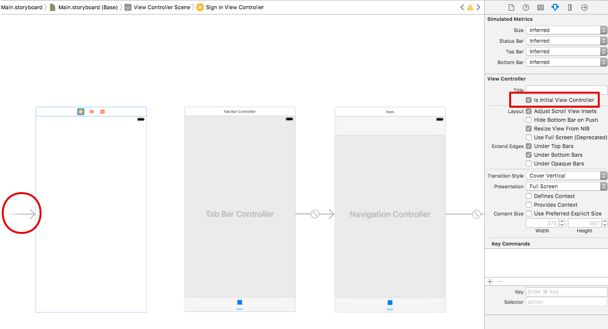

# 講義5 Firebase SDK の導入

この回では [CocoaPods](https://cocoapods.org/) というツールを使って FirebaseSDK を導入し、アプリで Firebase を使える状態にします。

CocoaPods は iOS/macOS アプリ開発向けのライブラリ管理ツールで、これを利用することで簡単にプロジェクトへ外部ライブラリを導入して使えるようになります。

## Podfile の作成

CocoaPods でライブラリを自分のプロジェクトへ導入するには、まず `Podfile` というファイルを作成する必要があります。
Podfile はプロジェクトに追加したいライブラリの名前や設定を列挙するファイルです。
プロジェクトのあるディレクトリで以下のコマンドを叩いて下さい。`Podfile` ファイルが作成されます。

```sh
> pod init
```

次に `Podfile` を以下のように編集してください。

```
platform :ios, '10.3'

target 'Cookpatodon' do
  use_frameworks!

  pod 'Firebase/Core'
  pod 'Firebase/Auth'
  pod 'Firebase/Database'
  pod 'FontAwesome.swift'
end
```

Firebase の関連ライブラリと、`FontAwesome` というシンボルフォントをアプリで使えるようするライブラリを導入します。

## CocoaPods を用いたライブラリの導入

Podfile の編集ができたら、`pod install` コマンドを実行してライブラリのダウンロードとプロジェクト設定を行います。
コマンドの実行に成功したら、一度 Xcode プロジェクトを閉じ、コマンドのメッセージに従って `Cookpatodon.xcworkspace` ファイルの方を開きます。

## Firebase プロジェクトへの接続設定

次にこちらで用意した Firebase プロジェクトにアプリから接続するための設定を行います。
~~~ GoogleService-Info.plist ファイルをここからダウンロードしてください。 ~~~

**注: インターン当日では講師が予め用意しておいた Firebase プロジェクトに接続できるよう GoogleService-Info.plist ファイルを配布していました。この資料をもとに課題をなぞって学習する場合は、 Realtime Databae を利用できる Firebase プロジェクトを自分で用意する必要があります。ここで具体的な手順を説明するつもりはありません。 Firebase 公式サイトをご覧ください。**

ダウンロードしたファイルを自分のプロジェクトのCookpatodonディレクトリ(AppDelegate.swift などがおいてあるディレクトリ)に配置し、プロジェクトに追加します。
ファイルツリーにドラッグアンドドロップすることでプロジェクトに追加できます。最初からある `Info.plist` の下に追加しましょう。

そして `AppDelegate.swift` を開きコードを追加します。
ファイルの先頭の方に `import Firebase` という行を追加し、`application didFinishLaunchingWithOptions...` というメソッドの中に次のコードを追加します。

```swift
FirebaseApp.configure()
```

以上で Firebase SDK を使う準備が整いました。

## 匿名ユーザでサインインする

正しく Firebase の設定ができているかを確認するために、匿名ユーザでサインインしてみます。

### SignInViewController を Storyboard に追加する

前回までに作成した `PostListViewController` を表示する前に表示する Firebase プロジェクトへサインインするだけの画面 `SignInViewController` を実装します。アプリが起動すると最初にこの画面を表示し、Firebase プロジェクトへのサインインを行い、成功したら PostListViewController を含むタブ画面に遷移するようにします。

Xcode のファイルツリーペインから ViewController グループ下に `SignInViewController.swift` を作成してください。次に `main.storyboard` でも ViewController を新しい画面として追加します。
追加できたら、SignInViewController をカスタムクラスに指定して下さい。

その後、新しく追加した SignInViewController をアプリケーション直後に表示される画面として指定します。この ViewController を指定した状態で、右ペインの **Is InitialViewController** にチェックマークを入れます。すると画像のような矢印が SignInViewController に移動します。この矢印はアプリケーションが起動した時に表示する画面を指しています。



PostListViewController を含む TabBarController に ID を振ります。
TabBarController を選択した状態で Storyboard ID の項目に `HomeTabBarController` を入力してください。こうすることでプログラムからIDを用いてこのViewControllerのインスタンスを取得することができるようになります。


### SignInViewController を実装する

Storyboard での設定が済んだら、SignInViewController.swift をエディタで開き、以下のように編集してください。

```swift
import UIKit
import Firebase
import FirebaseAuth

class SignInViewController: UIViewController {
    override func viewWillAppear(_ animated: Bool) {
        super.viewWillAppear(animated)

        Auth.auth().signInAnonymously { _ in
            self.presentHomeTabView()
        }
    }

    private func presentHomeTabView() {
        let storyboard = UIStoryboard(name: "Main", bundle: nil)
        let viewController = storyboard.instantiateViewController(withIdentifier: "HomeTabBarController")
        viewController.modalTransitionStyle = .crossDissolve

        present(viewController, animated: true, completion: nil)
    }
}
```

FirebaseSDK の設定や Storyboard の設定が正しくできていれば、アプリを起動するとFirebaseプロジェクトにサインイン後、前回までに実装してきた投稿一覧画面が表示されるはずです。