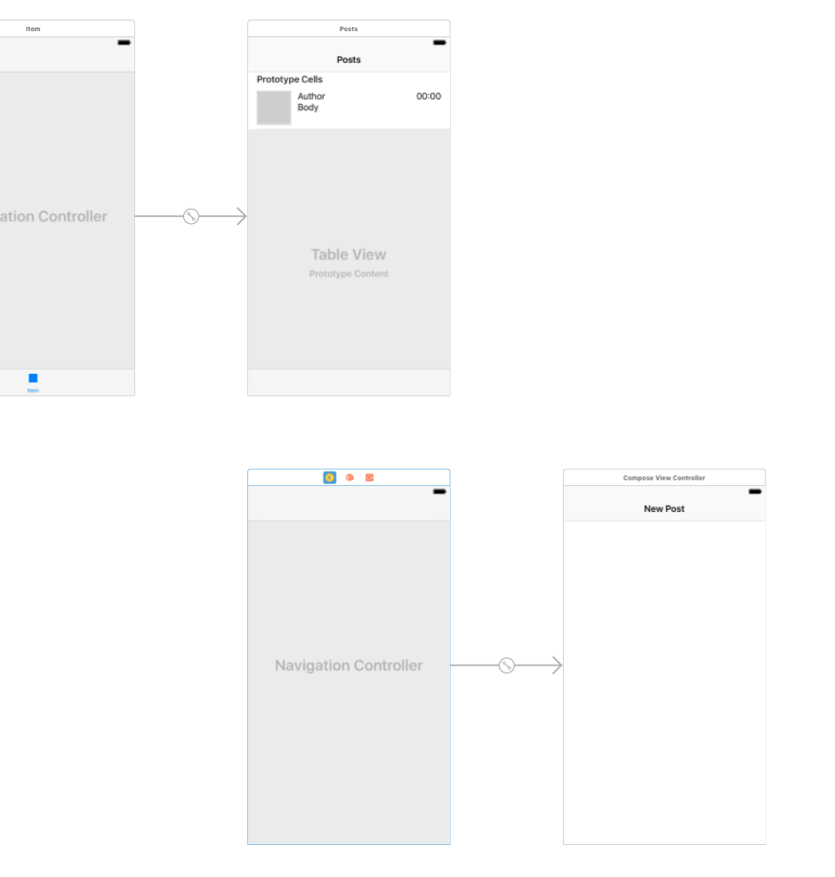
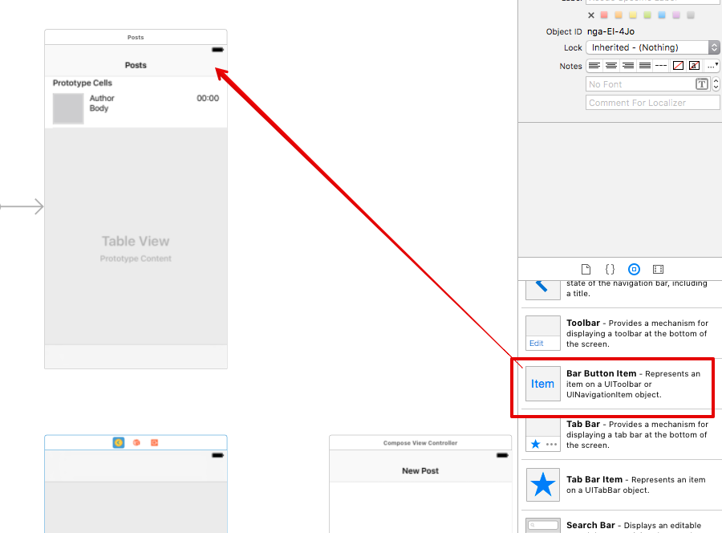
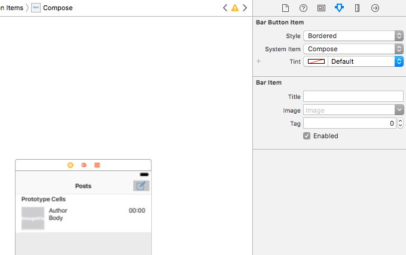
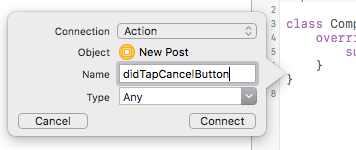

# 講義7 Storyboard を用いた画面遷移

投稿一覧画面ができたところで、次はメッセージ投稿画面に遷移するようにしたい。
メッセージ投稿画面のViewControllerである `ComposeViewController` を作ってそこに遷移できるようにする。

## ComposeViewController の追加

今までと同じように `ComposeViewController.swift` を ViewController グループ下に作成する。Storyboard でも ViewController を追加して、作成したクラスをひも付ける。どの画面にいるのか示すために NavigationBar を表示したいので NavigationController に Embed In する。NavigationTitle には `New Post` と言う文字列を指定しよう。

ここまでの操作を行うと以下のような状態になっているはず。



## 投稿一覧画面からメッセージ投稿画面を表示する

投稿一覧画面の右上に投稿ボタンを配置し、このボタンを押したらメッセージ投稿画面を表示するようにする。まず Storyboard で投稿ボタンを配置しよう。



配置後、ボタンを選択した状態で右ペインの System Item の値を変更することでシステムに用意されているボタンの種類の中から選んで変更することができる。ここでは `Compose` を選択する。



ボタンが設定できたら、ボタンの位置から Control キーを押しながらドラッグすると青い線が出る。この青い線を NavigationController まで引っ張って話すと、ボタンに反応して画面を開く設定ができる。Action Segue という項目が出るのでそのなかの `Present Modally` を選択する。

ここまでできたらアプリケーションをビルドして実行し、メッセージ投稿画面が開けるようになったことを確認する。

## メッセージ投稿画面にキャンセル、投稿確定ボタンを追加する

メッセージ投稿画面が表示できるようになったが、一方通行で一度開くと何もできなくなってしまった。
そこで、メッセージ投稿画面で投稿のキャンセル、投稿を確定するボタンを追加する。

先程の投稿ボタンと同じように BarButtonItem を左右に配置する。左側にキャンセルを右側に投稿ボタンを設置しよう。キャンセルボタンは SystemItem の中に `Cancel` があるが、投稿にふさわしそうなものはない。`Custom` を選択し、Title に "Post" と入力しよう。

ボタンの設置が終わったら AssistantEditor を開き、ComposeViewController.swift が画面に表示されているようにする。
ImageView や Label のアウトレットを接続したように、ボタンをコードまで引っ張って落とすとボタンを押した時に実行するメソッドをコードに追加することができる。コード上に落とした際にプロパティ名を選択する画面で以下の画像の様に Connection の項目を Outlet の代わりに Action とする。Name には "didTapCancelButton" とした。



Connect ボタンを押すと `didTapCancelButton` メソッドが追加される。このメソッドにボタンが押された際に実行したい処理を書くと、意図したとおりに動く。同様に投稿ボタンも `didTapPostButton` というアクションを接続しておこう。

追加したアクションに以下のようなコードを記述する。

```swift
@IBAction func didTapCancelButton(_ sender: Any) {
    print("cancel!")
    dismiss(animated: true, completion: nil)
}

@IBAction func didTapPostButton(_ sender: Any) {
    print("post!")
    dismiss(animated: true, completion: nil)
}
```

ViewController の dismiss メソッドを呼ぶことで画面を閉じることができる。キャンセルボタンも投稿ボタンも画面を閉じる処理を書いているが、Xcode のコンソールで cancel! や post! という文字列が表示されることでそれぞれが区別されていることがわかるはずです。