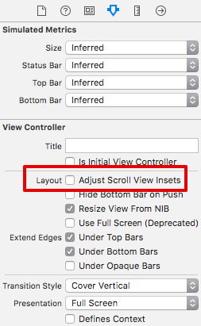

# 課題1 メッセージ投稿画面を実装する

※ここからは課題です。読んでコードを写すだけでは先に進めなくなっています。ドキュメントを読んだり試行錯誤をしながら画面を作っていって下さい。

メッセージを投稿する画面を実装してください。
メッセージの投稿は Realtime Database の posts/ 以下に データを追加することで行います。データ構造は[アプリの説明ページのデータベース構造の節](./cookpatodon_app.md)を参考にしてください。

Firebase SDK の API ドキュメントはこちら

- https://firebase.google.com/docs/database/ios/save-data
- https://firebase.google.com/docs/reference/

FirebaseDatabase の Classes などを読めば今回やりたいことは分かるはずです。

※ APIドキュメントの命名規則が古いバージョンのものなので Xcode のメッセージをみて置き換える必要があります

## 画面例


※ クリップや文字数が書かれている領域はこの課題中は無視して下さい

## ヒント

- 文字の入力領域は UITextView を使うと良いでしょう。画面いっぱいに広げちゃってください
- post_key とするユニークなキーは FirebaseSDK で作れます(`ref.child("posts").childByAutoId().key`)
- createDate に指定する現在時刻も FirebaseSDK で作れるものを使います(`ServerValue.timestamp()`)
- User の uid は `Auth.auth().currentUser?.uid`
- 値を一気に追加・更新するメソッドは `ref.updateChildValues(childUpdates)`

## 補足

### なんか TextView の変なマージンが気になるんだけど…

ComposeViewController を選択した状態で `Adjust Scroll View Insets` のチェックを外すと直る



### どういう値を保存すればよいかわからない…

投稿時に追加しないといけないデータが実は2箇所あります。

- `/posts/<post_key>`
    - author: uid
    - authorAvatar: アバター名
    - authorName: 投稿者名
    - body: 本文
    - createDate: `<unix time>`
- `/users/<uid>/posts/<post_key>`: true

## すごいヒント

- 投稿ボタンが押された時に投稿して欲しいから…投稿ボタン押した時に呼ばれる処理は前の回でやったはず
- 画面いっぱいに広げるには AutoLayout で上下左右のマージンを 0 にすればいいのかな
- TextView に入力された文字列をコードから取得したい、どうすればいいのだっけ？アウトレット接続？

### とりあえず今すぐ投稿したい、投稿部分のコードが想像もつかない（アルパカマンを呼ぶ）

```swift
func post() {
    guard let uid = Auth.auth().currentUser?.uid else {
        return
    }

    let key = ref.child("posts").childByAutoId().key
    let post: [String : Any] = [
        "author": uid,
        "authorAvatar": "arupaka",
        "authorName": "アルパカマン",
        "body": "私だ",
        "createDate": ServerValue.timestamp(),
    ]

    let childUpdates: [String: Any] = [
        "/posts/\(key)": post,
        "/users/\(uid)/posts/\(key)": true,
    ]

    ref.updateChildValues(childUpdates)
}
```