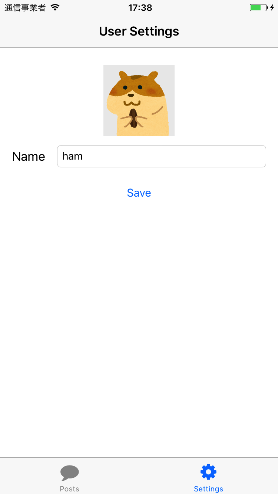
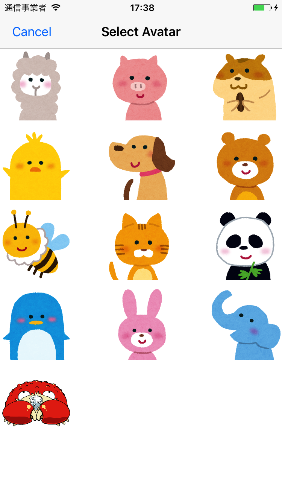

# 課題2 ユーザ情報登録画面を実装する

ユーザ情報登録画面を実装してください。
アプリ内で投稿者名やアバター画像を変更できるようにして、投稿時にそれが反映されるようにして下さい。
また、ユーザ情報を更新したら既存の投稿に紐づく投稿者名やアバター名の情報も更新するようにしてください。ただし、アプリを再起動するまで変更内容が画面に反映されなくても良いものとします。 `.childAdded` イベントの監視だけではそこまで実現できないためです。

## 画面例

|  |  |

- 画面を開くと前回までの設定を読み込んで現在のアバター画像、ユーザ名が表示されている
- 画像をタップするとアバター選択画面に遷移する
- アバター画像をタップすると前の画面戻り、選択した画像に切り替わっている
- Save ボタンを押すと RealtimeDatabase に書き込む

## ヒント

- いつものようにクラスファイルとStoryboardへの画面追加をして作業を始めましょう。
- アバター選択画面は、UICollectionViewController というクラスを使うと画面例のように画像を並べた画面にできます。
- 複数の画面をまたがって情報をやり取りする必要があるので、現在のユーザ情報を管理するクラスを作ると良いでしょう。そのようなクラスをシングルトンにして様々なクラスからアクセスできるようにすることは、アプリ開発でよくやる手です。

## 補足

### アバター画像をタップした時にアバター選択画面に遷移させるにはどうすれば？

UITapGestureRecognizer というタップに反応して何らかのアクションを実行する部品があります。
それをImageViewに指定します。ImageView の User Interacion Enabled にチェックを付けてください。質問があれば詳しく説明します。

必ずしも画面例のように作る必要は無いので、アバター選択画面に遷移するためのボタンを置いてもOKです。

### タブに吹き出しとか歯車のアイコン出したいんだけど

PostListViewController や UserSettingsViewController(または自分が命名したクラス名) に以下のコードを追加して下さい。 `import FontAwesome_swift` も必要です。

```
required init?(coder aDecoder: NSCoder) {
    super.init(coder: aDecoder)

    tabBarItem.image = UIImage.fontAwesomeIcon(name: .comment, textColor: .white, size: CGSize(width: 32, height: 32))
    tabBarItem.title = "Posts"
}
```

詳しくは以下のリンクを参考にしてください

- https://github.com/thii/FontAwesome.swift
- http://fontawesome.io/icons/

### シングルトンってなんだ、どうやって作るんだ

このように定義するクラスです。

```swift
class CookpatodonUser {
    static let current = CookpatodonUser()

    static let defaultName = "Unknown"
    static let defaultAvatarName = "unknown"

    var name: String = CookpatodonUser.defaultName
    var avatarName: String = CookpatodonUser.defaultAvatarName
}
```

以下のようにして複数のクラスから同一のインスタンスにアクセスできます。

```swift
let user = CookpatodonUser.current
user.name // => "Unknown"
user.name = "アルパカマン"
user.name // => "アルパカマン"
```

## すごいヒント

- ユーザ設定画面には ImageView や Label、 TextField、Button を追加すれば良さそうです
- アウトレットの接続やアクションの接続は今までのとおりです
- CookpatodonUser クラスにユーザ情報を取得したり保存する処理を実装すると使いやすいはず
- 過去の投稿のすべての投稿者名アバター、画像名を変更するなんてどうすればいいんだろう。そういえばなぜ投稿時に users/:uid/posts/:post_key にわざわざ記録をしていたんだろう？
- アバターの一覧は以下のとおりです

```swift
let avatarNames: [String] = [
    "arupaka",
    "buta",
    "hamster",
    "hiyoko",
    "inu",
    "kuma",
    "mitsubachi",
    "neko",
    "neko2",
    "panda",
    "penguin",
    "usagi",
    "zou",
    "kani",
]
```