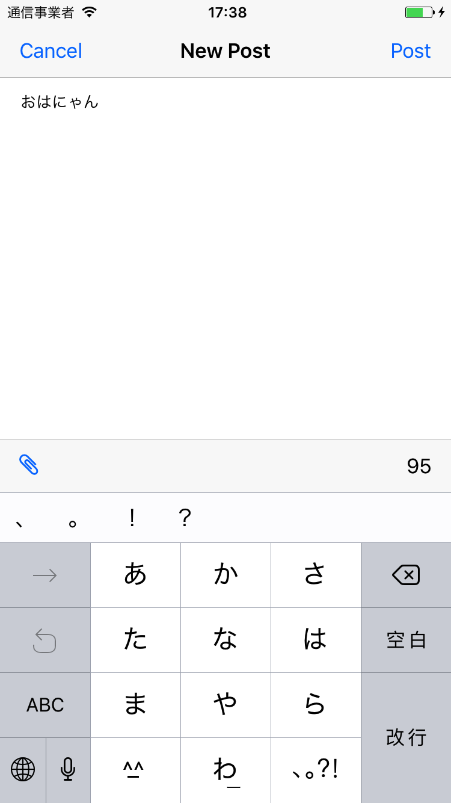
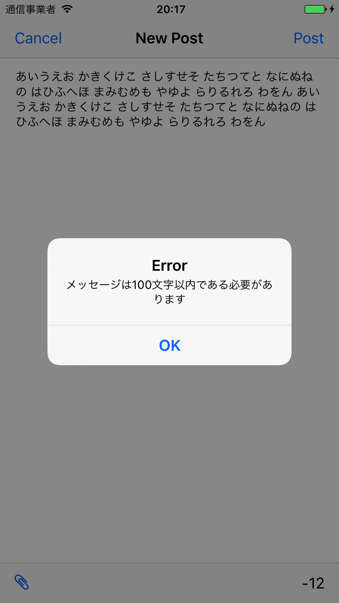

# 発展課題2 文字数カウンタを実装する

投稿画面に入力文字数のカウンタをつけてください。

- 入力文字に応じてリアルタイムにカウンタの値が変わるようにしてください
- 最大文字数は 100 としてください
- 入力文字列長を100から減算した値を表示します 
- 100文字を超えたメッセージを投稿しようとした時にはアラートでメッセージを表示してください

## 画面例

| |  |

## ヒント

- `UIToolbar` を使うと画面例にあるような見た目を再現できます
- `UIToolbar` もキーボードの領域に合わせて移動しないといけないので、ちょっと画面構成を修正する必要がありそう
- `UIBarButtonItem` には `CustomView` を指定できるものがある。文字を表示するためには `UILabel` を使うと良さそうだ。
- `UITextViewDelegate` を使うと `UITextView` の内容の変更を監視できるらしい
- アラートを表示するには `UIAlertController` を使います