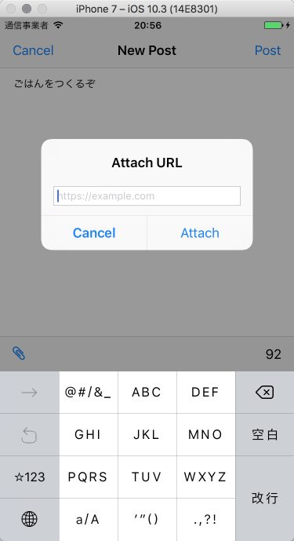
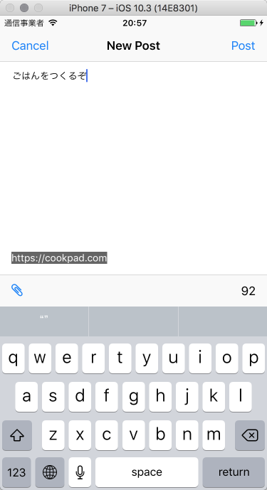

# 発展課題3 共有したいURLを含めた投稿に対応する

投稿に付加情報としてURLを付与して共有できるようにしてください。

- URL付き投稿の表示に対応してください
- URL付き投稿のセルをタップするとアプリ内WebViewでそのURLを表示できるようにしてください
- 投稿画面にURLを付与できるような機能を追加して下さい
- 投稿にURLを含める場合は `attachedURL` という key で URL の文字列を含め Firebase に保存するようにして下さい。

## 画面例

|  |  |  |

## ヒント

- Post 構造体で URL を持てるようにしよう。URL というクラスがあるのでそれを使うと URL として正しい文字列かどうか判断できる。文字列から URL インスタンスが作れない場合は URL として正しくない。表示前にも投稿時にも確認したいところ。
- PostCell の本文などを表示する Label を含む StackView に URLを表示するための Label を追加しよう
- Label の isHidden プロパティを true にすると Label を隠してくれる。StackView にいれたLabel であればその Label は無いものとして自動的にレイアウトしてくれる
- UIAlertController だけで文字を入力させるテキストフィールドを表示したり、その内容を取得したりできる。ドキュメントを読もう。
 