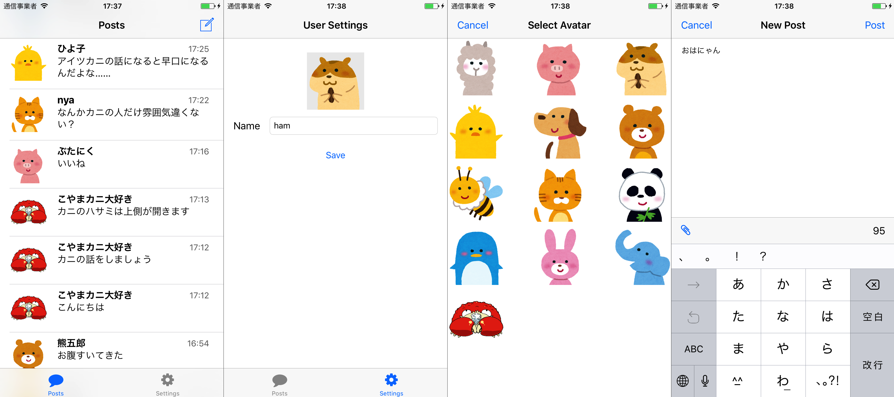

# Cookpatodon

この講義で作るアプリについて説明します。

## 内容

架空のSNSサービス「Cookpatodon（くっくぱっとどん）」の iOS アプリ

- メッセージを投稿できる
- 他の人や自分が投稿したメッセージが表示できる
- アバターアイコンと自分の表示名を変更できる



## 技術仕様

メッセージは Firebase Realtime Database を用いて記録します。
FirebaseSDK を利用してこの操作を行います。

### データベース構造

```
- posts
    - post1 (push した際に付与されるユニークな key)
        - author: "user1" (投稿者の Anonymous Auth アカウントの UID)
        - authorAvatar: "arupaka" (投稿者が選択したアバター画像の名前)
        - authorName: "アルパカ" (投稿者が設定した名前)
        - body: "こんにちは" （メッセージ本文）
        - createDate: 1500197527225 (ミリ秒まで含む unixtime)
    - post2
        - author: "user2"
        - authorAvatar: "buta"
        - authorName: "ブタ"
        - body: "今日のご飯は何にしよう"
        - createDate: 1500364971000
        - attachedURL: "https://cookpad.com" (option、発展課題3で使うメッセージ付与URL)
- users
    - user1 (Anonymous Auth アカウントの UID)
        - avatarName: "arupaka"
        - name: "アルパカ"
        - posts
            - post1: true (posts 以下に記録されている対応 post のキー、値は固定で true)
    - user2
        - avatarName: "buta"
        - name: "ブタ"
        - posts
            - post2: true
```

## このアプリを作るために必要な知識

- iOSアプリの基本的な画面の構築方法
- iOSアプリの基本的な画面遷移の構築方法
- 画像の表示方法
- Firebase SDK の使い方
